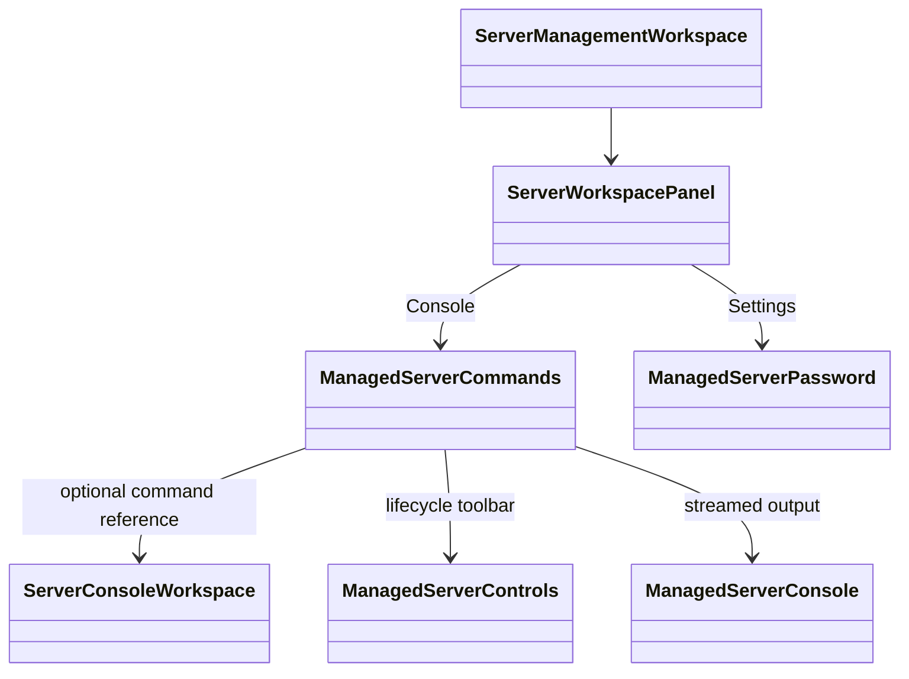
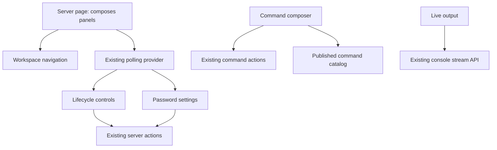

# Console UX review

## Problems

- The server header, three large status cards, console heading, lifecycle row, and live-output heading push the command input below the initial viewport.
- Password configuration interrupts the console workflow and looks like another command input.
- The permanently open command catalog competes with output and wraps long commands into narrow rows.
- The download icon and text stack because its supplied button class lacks an inline layout.
- Keyboard completion is not discoverable, despite being the primary input shortcut.

## Reorganization

Keep this scoped to the server workspace, not a site redesign. Preserve permissions,
confirmation dialogs, auto-connect, command delivery/retry identity, polling, and
result acknowledgement. No new inline status messages, backend behavior, or automatic retries.

1. Compact server identity/address header with inline runtime metadata.
2. One full-width console card: lifecycle/download toolbar, output, command input.
3. Remove redundant live-output headings; keep session guidance in the output's accessible description.
4. A collapsed, searchable command reference below the console on all screen sizes.
5. Owner-only password configuration in Settings, inside the existing polling provider.

## Ownership

The page composes the existing control/output components; the command composer
continues to receive those as slots. Password settings own their separate draft and
pending state while using the same action and polling boundary as before.

## Focused validation matrix

| Path | Expected behavior |
| --- | --- |
| Desktop/mobile console | Full-width output and command row; no horizontal overflow or password form in Console |
| Browse/search/select a command | Reference starts collapsed, search filters commands, selection closes it and focuses the unsent draft |
| Keyboard entry | Enter sends through confirmation; Tab accepts the visible dot-delimited completion |
| Navigate Console → Settings → Console | Password appears only in Settings; command draft and live stream remain mounted |
| Owner password change | Existing restart confirmation, pending guard, action payload, input clearing, and failure feedback preserved |
| Non-owner Settings | No password control |
| Command pending/result | Existing retry, polling, and acknowledgement controls remain functional |

Use targeted component/page tests plus desktop and mobile browser screenshots with
explicit sample data. Existing action/transport tests remain authoritative for backend behavior.
