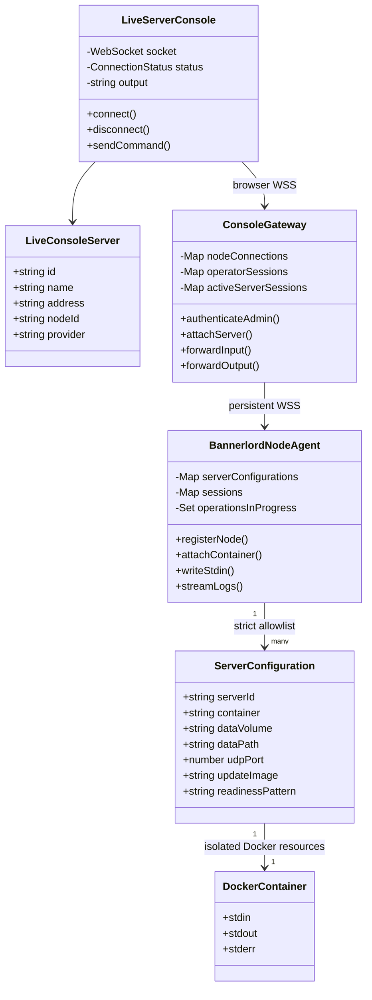
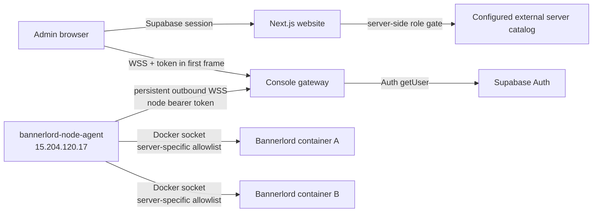

# Admin Live Server Console

## Required behavior

- Show explicitly configured live Bannerlord containers from the external VPS in the server-management area.
- Show that server and its console only to users whose current protected role resolves to exactly `Admin` (including configured bootstrap Admins).
- Stream the allowlisted Docker container's stdout/stderr and send entered commands to its stdin.
- Provide Admin-only Start, Stop, Restart, and Update buttons for the allowlisted game container.
- Keep this external-provider server separate from IONOS provisioning, destruction, and VPS management.
- Do not expose Docker Engine, SSH, node credentials, or a host shell to the browser.
- Use a persistent outbound WSS connection from the VPS node agent to the console gateway.
- Reauthenticate every browser console connection with Supabase Auth, require an allowed browser origin, limit one operator per server, and cap session lifetime.
- Render console output as escaped text with terminal control sequences removed and bounded browser memory.

## Minimum-complexity design

The current requirement has a small, Admin-only set of containers, so the website reads a strict server-only JSON catalog instead of introducing inventory, subscription, or assignment tables. Supabase remains the identity and protected-role source. A database-backed catalog can replace `src/app/lib/console/servers.ts` when servers or subscriptions become dynamic.

The browser never connects to the VPS. It opens the configured WSS gateway and sends its existing Supabase access token as the first WebSocket frame (never in a URL). The gateway calls Supabase `auth.getUser`, accepts only `app_metadata.role === "Admin"` or the matching bootstrap Admin email, and forgets the token after authentication. Each session is short-lived and one operator may attach to a server at a time.

The node agent makes the only connection from `15.204.120.17`: one outbound authenticated WSS connection. It maps each allowlisted website server ID to an isolated configuration containing a stable Docker name, named volume, host UDP port, update image, data path, and readiness marker. Container names, volumes, and ports must be unique. The protocol contains no arbitrary create, destroy, exec, or host-shell operation.

## Type relationships



## Dependency diagram



## Components

| Component | Path | Responsibility |
| --- | --- | --- |
| Admin fleet card | `src/app/components/servers/LiveConsoleServersSection.tsx` | Shows the external live server only when rendered by the Admin-gated server page. |
| Admin console route | `src/app/servers/live/[serverId]/page.tsx` | Re-fetches the Supabase user and rejects non-Admins before returning server data or UI. |
| Browser console | `src/app/components/servers/LiveServerConsole.tsx` | Authenticates, renders bounded escaped output, and sends line commands. |
| Server catalog | `src/app/lib/console/servers.ts` | Validates the optional multi-server catalog and the WSS browser URL. |
| Gateway | `services/console-gateway/` | Revalidates Admin access and bridges exactly one browser session to the registered node. |
| Node agent | `services/bannerlord-node-agent/` | Maintains one outbound WSS connection and targets only each server's configured container/resources. |

## Gateway deployment

The gateway is a standalone Node service. Terminate public TLS at a reverse proxy and proxy WebSocket upgrades to port `8787`; expose only the TLS endpoint and `/healthz` as needed.

```bash
cd services/console-gateway
cp .env.example .env
# Set the real origins, Supabase values, and a generated node token.
docker build -t bannerlord-console-gateway .
docker run --env-file .env --restart unless-stopped -p 127.0.0.1:8787:8787 bannerlord-console-gateway
```

Point the website's server-only `CONSOLE_GATEWAY_URL` at the public browser path:

```env
CONSOLE_GATEWAY_URL=wss://console.example.com/v1/browser
```

The reverse proxy must forward both paths:

- `/v1/browser` for Admin browsers.
- `/v1/node` for the authenticated node agent.

Do not put the Supabase token or node token in a query string. `CONSOLE_ALLOWED_ORIGINS` must contain exact website origins. Use the same `SUPABASE_ADMIN_EMAILS` value as the website so bootstrap Admin behavior remains consistent.

## Node deployment on `15.204.120.17`

The Bannerlord container must be created with stdin kept open (`docker run -i`, Compose `stdin_open: true`). The agent needs read/write access to the Docker socket and publishes no port.

```bash
cd services/bannerlord-node-agent
cp .env.example .env
# Set AGENT_SERVERS and the same node token as the gateway.
docker build -t bannerlord-node-agent .
docker run \
  --env-file .env \
  --restart unless-stopped \
  -v /var/run/docker.sock:/var/run/docker.sock \
  bannerlord-node-agent
```

Mounting the Docker socket is security-sensitive even though the agent protocol exposes only allowlisted attach/log operations. Restrict who can alter the agent image/environment, do not publish agent ports, and prefer a narrowly filtered Docker socket proxy when the host deployment supports one.

## Protocol and security boundary

- The gateway accepts browsers only on `/v1/browser` and exact configured origins.
- The browser sends `{ type: "authenticate", accessToken, serverId }` as its first WSS message.
- The gateway validates the token directly with Supabase and permits only the Admin role.
- The gateway accepts agents only on `/v1/node` with a 32+ character bearer token checked during the HTTP upgrade.
- Both gateway and agent independently check the server-to-node/container allowlists.
- Each configured server must use a unique container name, named volume, and host UDP port; ambiguous configurations fail agent startup.
- Before attach or any lifecycle operation, the agent inspects Docker and requires the resolved canonical name, mounted volume, container data path, and UDP binding to match that server's declaration.
- Console input is capped at 4 KiB per frame and 16 KiB per second, NUL bytes are rejected, and the protocol has no host shell or arbitrary Docker operation.
- The only Docker lifecycle operations are the fixed `start`, `stop`, `restart`, and `update` messages for an allowlisted stable container name. Operations are serialized per server and audited without command/token contents.
- Update requires the server to be running, pulls the configured image, performs no restart when its digest is unchanged, and rejects containers that do not exactly match the declared Bannerlord volume, UDP port, security, image-default, and restart-policy specification.
- A changed image is started under the canonical name while the stopped previous container is retained. Success requires the replacement to remain running and emit the configured readiness marker. Failure quarantines the replacement, restores the original name, restarts it when appropriate, and verifies recovery before reporting rollback success.
- Gateway operation ownership is independent of the browser session, so closing/reconnecting cannot release the per-server reservation while the node is still working.
- Both WebSocket hops cap queued data at 1 MiB and terminate a console session instead of buffering unbounded output; Docker stdin backpressure also terminates the affected session.
- Sessions default to ten minutes and are closed if the agent disconnects or reconnects.
- The gateway limits total browser sockets, per-address upgrade attempts, and concurrent Supabase validations. The public reverse proxy must add its own connection/request limits. Enable `CONSOLE_TRUST_PROXY` only when that proxy overwrites `X-Forwarded-For`.
- The gateway logs session/auth/attach/input metadata, but never command contents, Supabase tokens, node tokens, or console output.
- Production gateway connections must use `wss://`.

## Acceptance checks

- Admin sees every configured VPS server in `/servers` and can open each console.
- Two servers on one node can hold independent console sessions and lifecycle operations without targeting one another.
- Server Manager and customer roles do not receive the card and are redirected away from the console route.
- The gateway independently rejects anonymous, expired, and non-Admin Supabase sessions.
- A node with the wrong bearer token, node ID, or server mapping cannot register.
- Only the configured Bannerlord container can be attached; no Docker exec/create/destroy operation exists.
- The console displays a bounded log tail and live stdout/stderr, and line commands reach container stdin.
- Start, Stop, and Restart maintain the authenticated control channel and reattach logs/stdin after the container returns.
- Update no-ops on the current digest; a changed image must pass readiness or automatically restore the verified previous container.
- Disconnect, agent-offline, container-stopped, concurrent-operator, in-progress operation, and maximum-session states produce visible errors.
- `npm test`, `npm run lint`, and `npm run build` pass for the website, and both service entry points pass `node --check`.

## Deferred work

Dynamic `game_servers`, `server_nodes`, and `subscriptions` tables are intentionally deferred while the server set remains small, environment-configured, and Admin-only. MFA/recent-auth enforcement, persistent audit storage/retention, console session revocation, Docker socket proxy policy, and production deployment monitoring should be added before broadening access beyond the Admin role.
