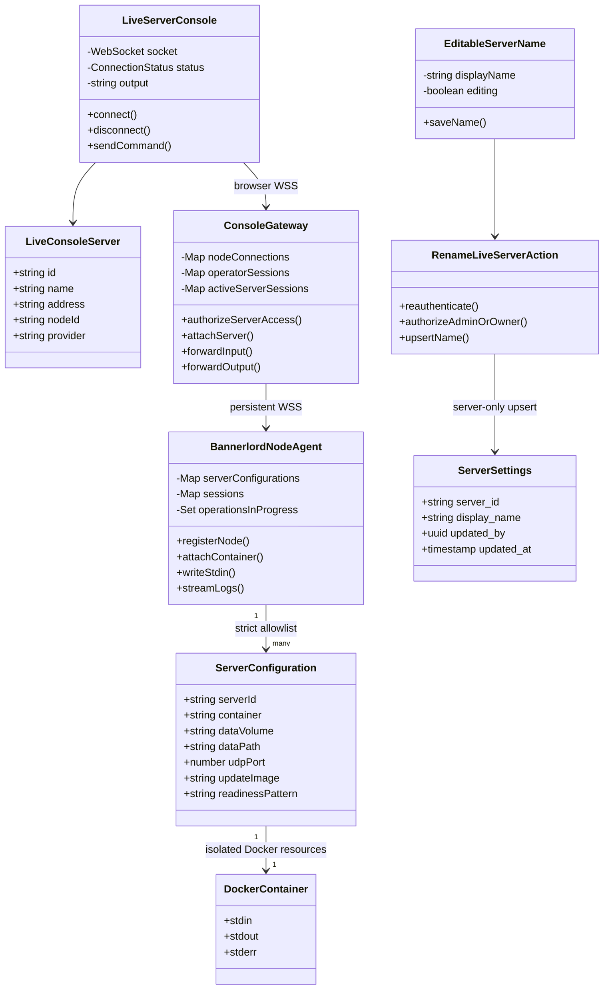
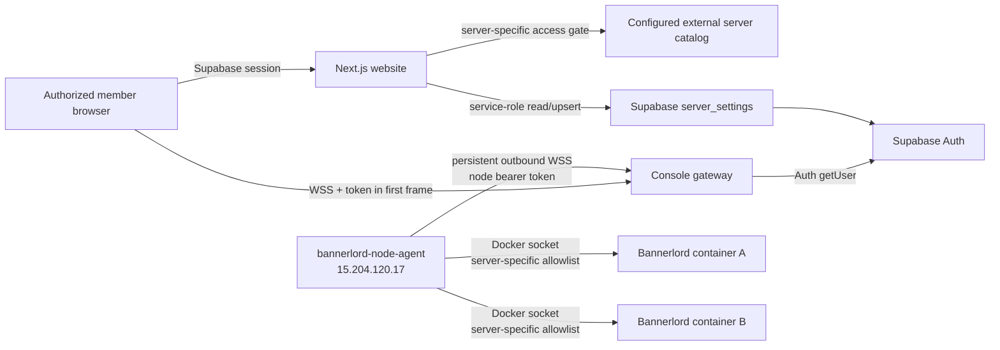

# Live Server Console Access

## Required behavior

- Show explicitly configured live Bannerlord containers in the same **My Servers** table as hosted servers.
- Open every hosted or live server from the unified `/servers/[serverId]` management route.
- Let Administrators see every configured server and assign exactly one owner account to each.
- Let an assigned owner add and remove operator accounts for that server.
- Show a server and its console only to Administrators, its owner, and its operators.
- Stream the allowlisted Docker container's stdout/stderr and send entered commands to its stdin.
- Keep protected Start, Stop, Restart, and Update buttons available after authentication regardless of the last observed container state; disable them only while disconnected or while another operation is pending.
- Let an Administrator or the assigned owner edit a live server's display name from its manage page and persist that name globally for every authorized viewer.
- Keep this external-provider server separate from IONOS provisioning, destruction, and VPS management.
- Do not expose Docker Engine, SSH, node credentials, or a host shell to the browser.
- Use a persistent outbound WSS connection from the VPS node agent to the console gateway.
- Reauthenticate every browser console connection with Supabase Auth, require an allowed browser origin, limit one operator per server, and cap session lifetime.
- Render console output as escaped text with terminal control sequences removed and bounded browser memory.

## Minimum-complexity design

The current requirement has a small set of containers, so the website reads a strict server-only JSON catalog instead of introducing an inventory table. Supabase remains the identity and protected-access source. Accessible catalog entries are adapted to the same directory-row shape as hosted servers, and `/servers/[serverId]` resolves either source before rendering the appropriate management controls. A minimal `public.server_settings` table stores only global display-name overrides; the environment catalog remains the fallback and the source of infrastructure identity. The table has RLS enabled and grants no browser-role access, so reads and writes stay behind server-only code using `SUPABASE_SECRET_KEY`.

Server IDs owned or operated by an account are stored in protected Auth `app_metadata.live_console_owner_server_ids` and `app_metadata.live_console_operator_server_ids` arrays. Authenticated server actions authorize the actor and catalog server, then use `SUPABASE_SECRET_KEY` to call the service-only `set_live_console_assignment` RPC. The RPC locks the Auth row and merges only the requested server assignment into current metadata, preserving concurrent role and Patreon grant changes. Apply `20260907230000_atomic_live_console_assignments.sql` before deploying these actions; writes fail closed when the RPC is missing. Assigning a new owner removes the previous owner and operators so delegated access cannot survive an ownership transfer. A database-backed assignment model can replace this metadata model when scale, transactional updates, or richer auditing are required.

The browser never connects to the VPS. It opens the configured WSS gateway and sends its existing Supabase access token as the first WebSocket frame (never in a URL). The gateway calls Supabase `auth.getUser` and independently accepts a matching bootstrap Administrator, `app_metadata.role === "Admin"`, or a server-specific owner/operator assignment. It forgets the token after authentication. Each session is short-lived and one operator may attach to a server at a time.

The node agent makes the only connection from `15.204.120.17`: one outbound authenticated WSS connection. It maps each allowlisted website server ID to an isolated configuration containing a stable Docker name, named volume, host UDP port, update image, data path, and readiness marker. Container names, volumes, and ports must be unique. The protocol contains no arbitrary create, destroy, exec, or host-shell operation.

## Type relationships



## Dependency diagram



## Components

| Component | Path | Responsibility |
| --- | --- | --- |
| My Servers table | `src/app/components/servers/ServerDirectoryTable.tsx` | Renders hosted and accessible live servers as identical management rows. |
| Unified manage route | `src/app/servers/[serverId]/page.tsx` | Resolves hosted or live server IDs, reauthenticates access, and renders the matching controls. |
| Assignment manager | `src/app/components/servers/LiveServerAccessManager.tsx` | Lives on a live server's manage page; lets Administrators assign an owner and lets Administrators/owners manage operators. |
| Assignment actions | `src/app/servers/access-actions.ts` | Reauthenticates every mutation, updates protected Supabase Auth metadata, and returns to the live server manage page. |
| Editable server name | `src/app/components/servers/EditableServerName.tsx` | Provides the inline edit icon, validated name field, pending state, and save feedback. |
| Rename action | `src/app/servers/name-actions.ts` | Reauthenticates, permits only Administrators/owners, and persists the global name override. |
| Server settings | `src/app/lib/hosting/server-settings.ts` | Reads and upserts global names through the server-only Supabase client. |
| Supabase migration | `supabase/migrations/202608240001_create_server_settings.sql` | Creates the RLS-protected `server_settings` table. |
| Legacy console route | `src/app/servers/live/[serverId]/page.tsx` | Redirects old console URLs to the unified manage route. |
| Browser console | `src/app/components/servers/LiveServerConsole.tsx` | Authenticates, renders bounded escaped output, and sends line commands. |
| Server catalog | `src/app/lib/console/servers.ts` | Validates the optional multi-server catalog and the WSS browser URL. |
| Gateway | `services/console-gateway/` | Revalidates Administrator or server-specific access and bridges exactly one browser session to the registered node. |
| Node agent | `services/bannerlord-node-agent/` | Maintains one outbound WSS connection and targets only each server's configured container/resources. |

## Gateway deployment

The gateway is a standalone Node service. Terminate public TLS at a reverse proxy and proxy WebSocket upgrades to port `8787`; expose only the TLS endpoint and `/healthz` as needed.

```bash
cd services/console-gateway
cp .env.example .env
# Set the real origins, Supabase values, and a generated node token.
docker build -t bannerlord-console-gateway .
docker run --env-file .env --restart unless-stopped -p 127.0.0.1:8787:8787 bannerlord-console-gateway
```

Point the website's server-only `CONSOLE_GATEWAY_URL` at the public browser path:

```env
CONSOLE_GATEWAY_URL=wss://console.example.com/v1/browser
```

The reverse proxy must forward both paths:

- `/v1/browser` for authorized Administrator, owner, and operator browsers.
- `/v1/node` for the authenticated node agent.

Do not put the Supabase token or node token in a query string. `CONSOLE_ALLOWED_ORIGINS` must contain exact website origins. Use the same `SUPABASE_ADMIN_EMAILS` value as the website so bootstrap Admin behavior remains consistent.

## Node deployment on `15.204.120.17`

The Bannerlord container must be created with stdin kept open (`docker run -i`, Compose `stdin_open: true`). The agent needs read/write access to the Docker socket and publishes no port.

```bash
cd services/bannerlord-node-agent
cp .env.example .env
# Set AGENT_SERVERS and the same node token as the gateway.
docker build -t bannerlord-node-agent .
docker run \
  --env-file .env \
  --restart unless-stopped \
  -v /var/run/docker.sock:/var/run/docker.sock \
  bannerlord-node-agent
```

Mounting the Docker socket is security-sensitive even though the agent protocol exposes only allowlisted attach/log operations. Restrict who can alter the agent image/environment, do not publish agent ports, and prefer a narrowly filtered Docker socket proxy when the host deployment supports one.

## Protocol and security boundary

- Server-name reads and writes use the server-only Supabase client; `anon` and `authenticated` have no direct `server_settings` table privileges.
- The rename Server Action reauthenticates every request and permits only Administrators or that server's assigned owner.
- The gateway accepts browsers only on `/v1/browser` and exact configured origins.
- The browser sends `{ type: "authenticate", accessToken, serverId }` as its first WSS message.
- The gateway validates the token directly with Supabase and permits Administrators or the requested server's assigned owner/operators.
- The gateway accepts agents only on `/v1/node` with a 32+ character bearer token checked during the HTTP upgrade.
- Both gateway and agent independently check the server-to-node/container allowlists.
- Each configured server must use a unique container name, named volume, and host UDP port; ambiguous configurations fail agent startup.
- Before attach or any lifecycle operation, the agent inspects Docker and requires the resolved canonical name, mounted volume, container data path, and UDP binding to match that server's declaration.
- Console input is capped at 4 KiB per frame and 16 KiB per second, NUL bytes are rejected, and the protocol has no host shell or arbitrary Docker operation.
- The only Docker lifecycle operations are the fixed `start`, `stop`, `restart`, and `update` messages for an allowlisted stable container name. Operations are serialized per server and audited without command/token contents.
- Update works while the server is running or stopped, preserves that prior run state, pulls the configured image, performs no replacement when its digest is unchanged, and rejects containers that do not exactly match the declared Bannerlord volume, UDP port, security, image-default, and restart-policy specification.
- A changed image is started under the canonical name while the stopped previous container is retained. Success requires the replacement to remain running and emit the configured readiness marker. Failure quarantines the replacement, restores the original name, restarts it when appropriate, and verifies recovery before reporting rollback success.
- Gateway operation ownership is independent of the browser session, so closing/reconnecting cannot release the per-server reservation while the node is still working.
- Both WebSocket hops cap queued data at 1 MiB and terminate a console session instead of buffering unbounded output; Docker stdin backpressure also terminates the affected session.
- Sessions default to ten minutes and are closed if the agent disconnects or reconnects.
- The gateway limits total browser sockets, per-address upgrade attempts, and concurrent Supabase validations. The public reverse proxy must add its own connection/request limits. Enable `CONSOLE_TRUST_PROXY` only when that proxy overwrites `X-Forwarded-For`.
- The gateway logs session/auth/attach/input metadata, but never command contents, Supabase tokens, node tokens, or console output.
- Production gateway connections must use `wss://`.

## Acceptance checks

- Hosted and accessible live servers appear together in one **My Servers** table with the same Manage action.
- Administrators see every configured VPS server and open it at `/servers/[serverId]`.
- Legacy `/servers/live/[serverId]` links redirect to the unified manage route.
- Administrators and owners see an edit icon beside the live server name; operators do not.
- A saved name appears globally on the manage page and in **My Servers**, with the catalog name used when no override exists.
- Invalid, overlong, or multiline names are rejected server-side.
- An Administrator can assign or replace one owner; ownership transfer removes prior owner/operator access.
- Owners see their server, can add/remove operators, and can manage the console and lifecycle.
- Operators see and manage only their assigned servers and cannot change assignments.
- Two servers on one node can hold independent console sessions and lifecycle operations without targeting one another.
- Unassigned members do not receive the card and are redirected away from the console route.
- The gateway independently rejects anonymous, expired, and server-unassigned Supabase sessions.
- A node with the wrong bearer token, node ID, or server mapping cannot register.
- Only the configured Bannerlord container can be attached; no Docker exec/create/destroy operation exists.
- The console displays a bounded log tail and live stdout/stderr, and line commands reach container stdin.
- Start, Stop, Restart, and Update remain available for every observed container state once the control channel is authenticated, while the node agent resolves the actual state safely.
- Start, Stop, and Restart maintain the authenticated control channel and reattach logs/stdin after the container returns.
- Update no-ops on the current digest; a changed image preserves the server's prior running/stopped state and must pass readiness when started or automatically restore the verified previous container.
- Disconnect, agent-offline, container-stopped, concurrent-operator, in-progress operation, and maximum-session states produce visible errors.
- `npm test`, `npm run lint`, and `npm run build` pass for the website, and both service entry points pass `node --check`.

## Deferred work

Dynamic `game_servers`, `server_nodes`, and assignment tables are intentionally deferred while the server set and account directory remain small. Move assignments out of Auth metadata before exceeding the bounded user scan or requiring transactional ownership transfer. MFA/recent-auth enforcement, immediate revocation of an already-open console session, persistent audit storage/retention, Docker socket proxy policy, and production deployment monitoring remain deferred.


Manual administrator role saves use the separate service-only finite `set_member_role`
RPC from website080003. Both writers merge only their keys under current Auth row
locks, never stale unrelated metadata. Refusal is busy/retry, not success. Refresh
assignments before retrying multi-account edits. See [combined locking and retry](membership-locking.md).

## Managed log-download identity

The canonical `/servers/[serverId]` page denies a recognized live server before
loading managed assignments or considering a preview if the verified user lacks
live-server access. Managed access alone cannot authorize that live page. The
console gateway continues to independently authorize every console connection.

A live catalog ID need not equal its real managed UUID. The website-only
`CONSOLE_SERVER_CATALOG` accepts an optional `managedServerId` for **log downloads
only**:

```json
[{"id":"live-server-one","name":"Server One","address":"203.0.113.10:4200","nodeId":"node-one","provider":"External VPS","managedServerId":"abcdef12-1234-4123-8123-123456789abc"}]
```

This implements the managed-identity mapping alternative in
[ControlPlane issue #190](https://github.com/Bannerlord-Coop-Team/BannerlordCoop.ControlPlane/issues/190),
not a new download backend for standalone Docker servers. Before configuring it:

1. Confirm the live identity and managed UUID identify the **same actual game
   server and log data**, not merely the same VPS, owner, display name, or port.
   Use the existing managed-hosting enrollment/assignment workflow if the resource
   is not yet managed. Registering inventory or creating a placeholder database
   record is insufficient. Never create a second writer/controller for an active
   live container just to enable this button.
2. Confirm the managed server has an active resource generation and a reachable
   managed agent supporting `read-latest-log`. Existing external Docker console
   agents do not implement that protocol; this change does not convert them or
   adopt their containers. Any migration requires a separately reviewed rollout
   following the control-plane
   [managed-agent runbook](https://github.com/Bannerlord-Coop-Team/BannerlordCoop.ControlPlane/blob/main/docs/managed-hosting/managed-agent-service.md).
3. Grant intended download users the existing managed owner/manager access through
   supported access workflows. Live owner/operator/admin assignments are not
   managed grants; this field neither grants access nor transfers ownership.
4. Set the mapping in the server-only website catalog through the normal reviewed
   configuration rollout. Do not change gateway/node server IDs or send the UUID
   as a console identity. With an authorized account, verify the downloaded file
   belongs to this exact server; also verify an unrelated account is denied.
   No live onboarding, configuration, or download is performed by this PR.

The page resolves the configured UUID **only** within the current user's
`listAllMyServers` response and offers logs only for owner/manager access. An
explicit missing/inaccessible mapping never falls back to another server. Without
a mapping, existing same-ID matching remains supported. Missing managed access,
a failed managed lookup, or missing onboarding leaves downloads unavailable with
an explanation; it does not prevent an otherwise authorized live console page.

Downloads use the unchanged managed latest-log endpoint, not the truncated
console display or Docker stdout. Its bearer reauthentication, current managed
ACL/generation checks, safe `.log` filename, actual file bytes, and **100 MiB**
limit remain authoritative. Lifecycle, visibility, settings, saves and backups
are not enabled by this log mapping. Preview servers and `/servers/wireframe`
remain demos. A genuinely standalone live server still needs managed onboarding
or a separately implemented authorized file-download integration.
