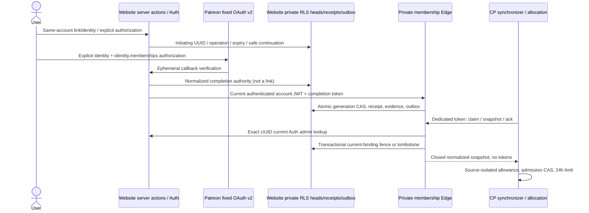

# Source-owned account and membership onboarding

The edge-owned commit cutover below is pending; this change performs no deployment
or remote schema mutation. Previously deployed Patreon JSON:API handling and safe
callback diagnostics are retained unchanged.

This composes reviewed website histories `93ab60b` (owner onboarding) and
`e8a6648ca64b8ae0e8cbd43d31620eec720b131f` (Patreon identity linking), without the
separate regional administrator PR95. Backend contract: local `4160f7b` and
`docs/managed-hosting/membership-onboarding.md` in the control-plane repository.

## Subscription-benefit policy, not payment settlement

The parent explicitly approved **Patreon-reported current entitlement**, not
proof that the most recent $20 charge settled. Policy v1 requires the exact
configured campaign and qualifying tier IDs, campaign currency USD, the tier's
reported amount at least 2000 cents, member currently-entitled amount at least
2000, `patron_status=active_patron`, `last_charge_status=Paid`, a nonfuture
last-charge timestamp, and explicitly false free-trial/gift flags. All identity,
member/user, member/campaign and entitled-tier/campaign relationships must be
complete and agree. Marketing names, lifetime contributions, email, and metadata
are never membership evidence.

**Intentional unpaid-upgrade case:** Patreon documents currently-entitled tiers
and amount as including a *current pledge OR a payment covering the current
period*. An upgraded tier already reported entitled while the member remains
active/Paid can qualify before an incremental charge. This is subscription-benefit
policy, **not evidence that $20 was captured**. Independent review must examine
this explicit adjustment to the earlier minimum design's settlement language.

Read-only primary source checked: <https://docs.patreon.com/>, APIv2 Identity,
Member attributes/relationships, Tier relationships, Campaign currency and the
v1→v2 migration guide. `last_charge_date` means last **attempted** charge, not a
paid-through deadline. No paid-through date is available in this adapter's
supported response: `paidThroughAt` is always null. We never request or infer
expiry from `next_charge_date`, pledge cadence, lifetime payment or last charge.
Former/cancelled patrons without independent paid-through evidence are
`review_required`; declined evidence is nonqualifying; missing/ambiguous fields,
pending/unknown charge status, free trials/gifts, duplicate resources and incomplete
pagination require review. Unexpected identity response is a failed authorization.
The adapter deliberately refuses incomplete pages rather than following arbitrary
provider-supplied URLs. This is safe denial, not a claim to support every account.

The fixed identity URL requests `identity identity.memberships`, includes
`memberships.campaign,memberships.currently_entitled_tiers.campaign,memberships.user`,
and explicitly requests the member status/charge/entitled amount/free-trial/gift,
campaign currency and tier amount fields. HTTPS destinations are fixed, redirects
refused, response bodies/counts and request deadlines bounded. Provider access and
refresh tokens exist only during callback processing; no tokens/raw bodies are
persisted or logged. Only normalized evidence and its SHA256 digest are retained.
A crash between code exchange and normalized persistence requires fresh OAuth.
This CP evidence adapter has **no unattended Patreon polling or token refresh**. The independent PR104 website-role worker polls with its distinct creator token and policy; website roles never establish CP allowance.

Positive evidence lasts at most 24 hours and funds only **new allocation**.
`max(administrativeBase, qualifyingPatreonOne) + administrativeBonus` is the backend
reducer; never add an extra membership slot to an existing administrative base.
Administrative suspension remains authoritative. Adequate independent grants bypass
membership outages/configuration. Expiry/unlink/unknown evidence never Stop, delete,
revoke administrative grants, transfer servers, or start a grace countdown. Existing
owner Start/Stop/saves remain accessible. Beginning a new Patreon check invalidates
old positive evidence immediately, including cancellation or provider outage.

## Same-account flow and Edge commit

1. Sign in to the intended website account. `/servers` checks current Auth provider
   identities before allocation. **Confirm and connect Discord** uses Supabase
   `linkIdentity`, never sign-in, an email match or automatic account merge.
2. A server-held Discord request stores initiating UUID, operation UUID, safe return
   path and ten-minute expiry. Its random token is in a Secure, HttpOnly, host-only
   cookie. Supabase still owns OAuth state/PKCE. Before code exchange, the website
   callback checks current `getUser`/`getSession` agreement and token ownership via
   authenticated Edge. After successful exchange it verifies the same account and
   current Discord identity, and checks the returned session matches that account.
   Only the website server's existing `SUPABASE_SECRET_KEY` admin seam can stamp
   successful PKCE using `membership_discord_callback`; missing configuration fails
   before code exchange. Public JWT endpoints cannot infer this marker from Auth.
3. The callback immediately invokes JWT-authenticated Edge `discord-confirm`.
   Edge reads authoritative Auth; SQL requires the exact marker/current Discord,
   current generation and unexpired authority before committing confirmation. The
   existing `callback_generation` stores the initiating generation until attestation,
   then the post-fence generation. A new explicit Discord attempt deletes only
   unconfirmed requests; confirmed receipts remain immutable. A status/Patreon fence
   can conservatively supersede an unstamped callback. This does not unlink Auth:
   current Auth linking is independently authoritative and usable even if website
   confirmation failed. There is no manual confirmation/recovery step. Disabled
   manual linking, conflicting identity or account switches fail closed, never merge.
4. Patreon launch/state are one-use, hashed and browser-cookie bound. The anonymous
   provider callback verifies Patreon and issues only normalized completion authority.
   The website callback validates current authenticated `getUser`/`getSession`
   agreement and immediately invokes `patreon-complete` with that session's JWT.
   Edge independently authenticates; SQL checks the completion token's initiating
   account, generation and expiry. A forwarded initiation ticket never commits in
   the anonymous provider callback. No Patreon completion cookie/client auto-submit
   or Recover/Resolve UI exists.
5. `membership_complete` is the atomic website DB commit point: token consumption,
   globally unique Patreon binding, evidence, revision, immutable receipt and outbox
   hint succeed together or roll back. OAuth/remote Auth are not a distributed SQL
   transaction. A duplicate token returns its original receipt without relinking,
   even after unlink; a foreign account cannot use it. Current status, not historical
   receipt flags or query parameters, determines the landing page's connection UI.
6. On failed/expired/lost outcomes, check current status and explicitly connect or
   verify again if needed. A new Patreon authorization increments generation, fencing
   older callbacks. New Discord attempts supersede unfinished requests. No durable
   unacknowledged reference locks out reconnect. Rate limits/outbox backpressure
   remain; no automatic retry loop or guaranteed wait time is promised. Discord
   response handlers never delete shared cookies (a late response could erase a
   newer attempt); they naturally expire or are replaced by explicit initiation.
   `/servers` exact-UUID allocation recovery and ownership policy are unchanged.

## Recovery-table removal: coordinated cutover and rollback

`202609110001_edge_owned_link_commit.sql` is pending, forward-only website history.
Do not rewrite/replay the historical onboarding or role/concurrency migrations.
The migration replaces the five recovery-dependent begin/check/callback/confirm RPCs,
drops `membership_completion_intent` trigger/function and `membership_recovery` RPC,
then drops `membership_recovery_intents` without CASCADE. It adds no table or column.
The existing atomic Patreon completion RPC, receipts, RLS/grants, account locks,
role synchronization, membership policy and receipt-driven outbox delivery remain.

For an authorized future cutover, pause account-link entry points/drain callbacks,
review exact migration inventory and backups, apply the forward migration, deploy the
matching website callbacks/UI and `website-account` Edge, then reopen linking.
Do not leave the old website active after the drop: it calls removed recovery APIs
and can hide Connect. New website against old SQL can still hit the old intent lockout.
An old anonymous Patreon callback remains compatible (same normalized authority and
JSON:API fix), but old browser confirmation pages should reload or restart. This is
not a production deployment instruction executed by this change.

The migration deliberately deletes **unconfirmed in-flight Discord requests** rather
than guessing their initiation generation; those attempts must reauthorize once if
Auth is not already linked. Already-linked Auth stays usable independently. Confirmed
Discord requests and Patreon completion receipts survive unchanged. Patreon state
and completion rows retain their existing expiry/generation fences. Dropped intent
references cannot be reconstructed safely from receipts and must not be restored as
new authorization.

This is not a simple old-binary rollback: old UI/Edge require removed schema. Prefer
roll-forward repair while preserving the new schema, or prepare a separately reviewed
compatible rollback release. Restoring the old DB backup would lose subsequent valid
links/receipts/outbox changes and is not an acceptable automatic rollback. Keep account
linking paused during a failed cutover; never weaken account/generation checks to
rescue a consumed callback. No remote DB changes or production drop occurred here.

Full regions remain selectable for persistent Request, without reservation or ETA.
Create remains stopped; first Start uses the bundled default save. Password controls
remain the documented Discord owner path, not a new web password endpoint.

## Exact closed contracts and storage ownership

Private endpoint (no browser/CORS authority):
`POST https://wfvqnijwuyqjibhlcrhz.supabase.co/functions/v1/control-plane-membership-v1`.
The Supabase gateway owns the `/functions/v1` prefix; the deployed Deno handler
therefore validates the exact function-relative pathname
`/control-plane-membership-v1`, not the external gateway pathname.
`Authorization: Bearer <64 lowercase hex>` is a **dedicated** synchronization
credential, not a service-role key. The verifier uses a full fixed-length digest
comparison. The current contract is strict v1 `snapshot({accountId})` plus v2
`claim({claimId,limit<=50})` and `ack({eventId,receiptId,claimId})`. The legacy v1
changes/ACK envelopes remain server-only for a bounded rollback. Unknown
fields/operations fail.
Every snapshot authoritatively looks up the exact account via Auth admin API;
404 becomes a tombstone, outage fails closed, identities never fall back to metadata.
Patreon is a website-owned binding, not a Supabase provider identity.

`membership.ts` contains the exact private snapshot contract (all keys required,
nullable semantics, decimal strings, provider ID bounds, UTC millisecond times).
It matches CP `membership-contract.ts`. `server-onboarding-contract.ts` parses CP
allocation **version 2**, including source breakdown and freshness, retaining all
six ordered regions. No private provider IDs enter the public account status or
website summary. `membership-onboarding.ts` owns strict authenticated status parsing
and public summary v2 status/next-action composition.

Website migrations: `202609080002_membership_onboarding.sql` then append-only
`202609080003_membership_role_locking.sql`, `20260908030000_patreon_event_reconciliation.sql`,
then `20260910200000_membership_receipt_claims.sql`, **after** backend
`202609080001_control_plane_membership_sources.sql`. No applied migration is edited;
`20260907212654_create_patreon_links.sql` remains byte-identical to merged PR103.
Four new public-schema tables are RLS enabled and client grants denied:
`membership_heads`, `membership_outbox`, `membership_completion_receipts`,
`discord_link_requests`. Heads, receipts and outbox have no cascading Auth FK.
An Auth BEFORE DELETE trigger records a preserved tombstone before legacy OAuth/link
rows cascade. Existing identity-only links migrate as unverified, never paid evidence.
New server RPCs use fixed empty search paths, service-role-only EXECUTE and no
browser grants. Service role has no direct new-table privileges; narrow functions
own writes. Existing private OAuth states gain operation/generation/return/evidence
columns. Do not use legacy handlers with new membership enablement.

Each new explicit verification also advances generation, preventing an older OAuth
completion from overwriting a newer check. Verification-pending state is distinct
from outbox synchronization-pending state. Binding fences hold short SQL locks and invalidate evidence on observed Discord or
Patreon changes. Explicit unlink fences even an in-flight initially-unlinked flow.
Outbox delivery is receipt/lease driven: sequence is only a stable scheduling hint,
and every unacknowledged row remains eligible after its 45-second claim expires,
including a lower sequence that commits after a higher one was delivered. Claim IDs
make a lost claim response replay the same bounded page. ACK requires that live claim,
binds the first receipt forever, and exact replay succeeds while a changed receipt
conflicts. The old subsystem-wide commit-order advisory lock is a rolling-upgrade
no-op; account, Auth, Patreon tuple and role-worker singleton fences remain bounded.
Known binding reconciliation is an Auth check, not a Patreon refresh.
No retention/cleanup policy for durable receipts/tombstones is introduced.

## Configuration and rollout blockers

Nothing here provisions credentials, applies SQL, changes Auth/Patreon settings,
deploys Edge/Cloudflare/CP, pushes or merges GitHub. Membership remains disabled
without reviewed configuration. The production commissioning policy uses the
already-pinned campaign `16338430` and Standard Server tier `28995946`; provider
evidence must still independently prove USD and at least 2,000 cents.

Required reviewed runtime configuration:

- Existing Edge Patreon client ID/secret, exact HTTPS callback URI and canonical
  `PATREON_SITE_URL`. These remain Edge-only; never put them in Cloudflare/browser.
- Edge `HOSTING_MEMBERSHIP_POLICY_JSON`: strict `campaignId`, unique 1–50
  `qualifyingTierIds`, `currency:"USD"`, `minimumCents:2000`,
  `policyVersion:"patreon-paid-usd20-v1"`. Absent => no membership verification.
- Edge dedicated `HOSTING_MEMBERSHIP_SYNC_TOKEN`; CP receives the same scoped value
  through its separate owner-only encrypted systemd credential, **not** Supabase
  service-role authority. CP also requires its default-off membership enable flag,
  pinned origin and identical policy mapping.
- Website server-only `ACCOUNT_LINK_SITE_URL` = canonical HTTPS origin. No caller
  headers determine the Discord callback destination. Existing public Supabase
  URL/publishable key must be correct at runtime and for browser bundles.
- Supabase manual identity linking enabled, Discord provider enabled, exact
  `/account/discord/callback` allowlisted, registered Discord→Supabase callback
  correct, Patreon scopes and exact callback registered. No live setting changed.

Deployment gates: parent/reviewer approves policy and exact bytes; coordinates the
**complete chronological shared migration union and byte pins in both repositories**;
additive backend migration then application with feature disabled; website migration;
deploy updated Patreon/my-servers/website-account/private Edge functions; provision
scoped credentials and reviewed settings; deploy website; prove real HTTPS
browser→Auth→Edge→CP with controlled accounts, identity switches, outages and replay;
only then explicitly enable membership policy. The dedicated private function alone
uses custom token verification; existing browser JWT functions still validate Auth.
Applications never apply migrations automatically. The historical mirror alone is
not evidence of deployed migration history. No unknown-file/include-all bypass.

## Local evidence versus production proof

Automated provider/API fixtures are synthetic; React/route tests mock Auth and Edge.
Real isolated PostgreSQL tests apply the unchanged populated Patreon baseline and
new migration, exercise RLS, injected rollback, competing completions, expiry,
identity changes, uniqueness, unlink/replay, outbox ack/restart and deletion tombstones.
No test supplies real OAuth membership, a production account, credentials, gameplay,
container commissioning or UDP reachability. Real browser HTTPS integration remains
blocked by reviewed runtime policy, credentials, callback/manual-link settings and
separate deployment authorization. Never disable TLS verification to claim it.

Reproduce: `npm test`, `npm run test:membership:postgres` with only an owned isolated
loopback fixture URL, `npx next typegen && npx tsc --noEmit`, focused changed-file ESLint,
credential-free Next and `WORKERS_CI=1` OpenNext builds. The PostgreSQL suite refuses
non-loopback or non-fixture database names and otherwise explicitly skips without
its fixture URL. Tests do not relax legacy UUID/session recovery or full-region UI.

## Bounded account mutations and revocation delivery

These are technical abuse limits, not membership business policy: at most **10 new
ordinary mutations per account per 10-minute window**, **4 live pending authorities**
across Patreon and Discord, **8 ordinary unacknowledged hints**, plus **1 reserved
revocation hint**. Begin and first completion consume ordinary budget; authenticated
exact completion/confirmation replay does not. Pending OAuth insertion is locked and
generation-checked even during callback replacement, so a consumed token cannot be
reissued after unlink. Only expired/superseded ephemeral authority is cleaned; durable
completion receipts, acknowledged events and confirmed Discord requests are retained.
The closed public throttle is HTTP429, JSON `{"error":"membership_rate_limited"}`.
There is no `Retry-After`: outbox delivery has no deterministic admission deadline.
Check current authenticated status before retrying. Ten-minute OAuth authority is never
extended, and waiting cannot guarantee admission. Expired/failed attempts can be
replaced by explicit authorization without a recovery/acknowledgment step.
Confirmed Discord receipt replay, like Patreon, precedes expiry and ordinary admission
while preserving account/current-identity fences. First Discord confirmation must
write the exact account/operation/hash row before its original exclusive deadline and
assert `RETURNING` plus the recorded confirmation timestamp before returning success.
If admission cleanup deletes the request or the deadline crosses inside the RPC, an
exception rolls back all admission, cleanup, head/outbox and receipt effects. Fixture-only
PG triggers cross that deadline at window reset and after cleanup; production has no
clock override or expiry extension. `tests/membership-edge-commit.test.ts` runs real SQL
in PGlite with the recovery table absent, covering forward cutover, account binding,
receipt replay, failure rollback and disconnect/reconnect. Component tests cover
immediate website callbacks and session switches. PGlite is single-connection, not
real multi-session contention or live browser OAuth/JWT evidence. The existing local
PostgreSQL/GoTrue suites require separately available isolated fixtures. The partial
`discord_link_requests_pending_account_expiry` index excludes retained confirmed
history from account/expiry admission scans. Local PostgreSQL EXPLAIN regressions
populate 50,000 confirmed rows without forcing the optimizer's scan choice.

Unlink, current-Auth fencing and Auth deletion must remain safe at budget. Redundant
unlink does not advance an already empty, unlinked head, but real pending authority
(including a temporarily consumed OAuth row's unknown generation) is fenced. It deletes
pending Patreon authority, invalidates evidence and uses reserved revocation capacity.
With all 9 hints pending, revocation advances the durable head without rewriting any
hint or receipt. At least one deliverable unacknowledged hint necessarily survives.
Every ACK, including retry/out-of-order ACK, takes the account lock
and atomically ensures a hint for the **newest head** exists after acknowledging the old
hint. A missing successor is inserted with a strictly newer cursor, within the 9-hint
bound. If insertion fails, the ACK rolls back. An already acknowledged newest-head hint
satisfies delivery; no duplicate is generated. Tombstone repair does not require Auth
or resurrect a deleted account. CP must acknowledge only applied snapshot receipts.
Status remains pending while any unacknowledged hint survives, including deferred wake.

This bounds per-account durable admission/backlog; it is **not global volumetric-abuse
prevention**. Historical receipts remain monotonic and retained, not pruned to satisfy a
space quota. Existing server access, administrative grants/revocation, current-binding
CAS and exact-UUID Create recovery are unchanged.

## Shared history: fixed representations, upgrade only

The exact 30-version inventory (20 exact-mirror dispositions and fixed10 exceptions) is pinned in
[`membership-migration-inventory.json`](membership-migration-inventory.json).
It records canonical LF Git SHA256/byte counts and ownership for every own file,
companion source HEAD `4160f7bda49c6dd7dab57b912811c793dec90ac3`, and the fixed ten
historical representation pairs. All pre-existing website paths and committed bytes
are unchanged, including the old Patreon migration. Ten previously missing,
noncolliding CP migrations through `202609080001` are exact committed Git-byte mirrors.
`202609080002` and `202609080003` are website-owned **new pending release SQL**, not already-applied external
history; their final pins must be added to CP's coordinated release catalog.

The ten historical exceptions (versions21074242/21083000/21100640/21112235 on202608,
202608240001, and202608260001–260005) are explicitly **different historical
representations of the same version, not SQL-equivalent aliases or authenticated
remote SQL**. Four early public-history pairs are both markers; website240001 and
260004–5 are actual server-settings/nightly SQL versus CP markers; website260001–3 are
markers versus CP private-schema/runtime-role/audit-sequence SQL. The JSON pins both
paths/hashes/byte counts. Fresh review must inspect this fixed matrix rather than
relax a helper to accept arbitrary aliases.

Supported deployment is **upgrade only via CP's coordinated release**, with its own
exact baseline inventory/pins unchanged and baseline already applied. Do not use
arbitrary website `supabase db push`, reset, migration repair, or replay markers to fill
missing baseline. A fresh bootstrap is unsupported/unproved by these history markers.
The website's version union does not prove remote applied state. Next backend stage
must pin the final website080002 and080003 bytes as pending, preserve its own exact catalog and
unknown/external-replay refusals, and test real isolated CLI pre-application, partial
and terminal release histories.

The 2026-09-10 reconciliation adds exact already-applied mirrors for Control Plane
versions `202609100012` and `20260910170000`, plus the authenticated 339-byte
production statement for `20260910213320_drop_unused_community_servers.sql`
(SHA-256 `8f20fe1de829d9494cf734d7500066fbf55e9367c3373a4945f128bef5413bf1`).
These files align source history and previews; production must never replay or
repair any of the three already-applied rows.

### PR102 provider identifier correction — enablement remains blocked

Patreon API v2 `member` resource IDs and relationship references, and private snapshot
`memberId`, are UUIDs (for example `03ca69c3-ebea-4b9a-8fac-e4a837873254`). User,
campaign and tier IDs remain strictly numeric. OAuth regression fixtures and the real
PostgreSQL history suite use that provider-realistic member UUID; public account status
continues to omit provider identifiers.

The paired ControlPlane head `dbd50dcb2dba567524df8351ba548b8fef8fb31b` still validates
`memberId` with its numeric `identifier` schema in `src/hosting/membership-contract.ts`.
It therefore does **not** accept the corrected producer contract yet. A matching UUID
consumer fix, its regressions, fresh exact-head review and live commissioning are
required before coordinated enablement. This website correction does not authorize
merge, deployment or changing the schema → ControlPlane → Edge → website rollout order.

See [combined PR104 locking and retry](membership-locking.md) for immutable applied PR104 history, the complete participating-lock/error contract, independent policies, explicit Auth deletion retry, pending migration rollout and realPG/GoTrue evidence limits.
