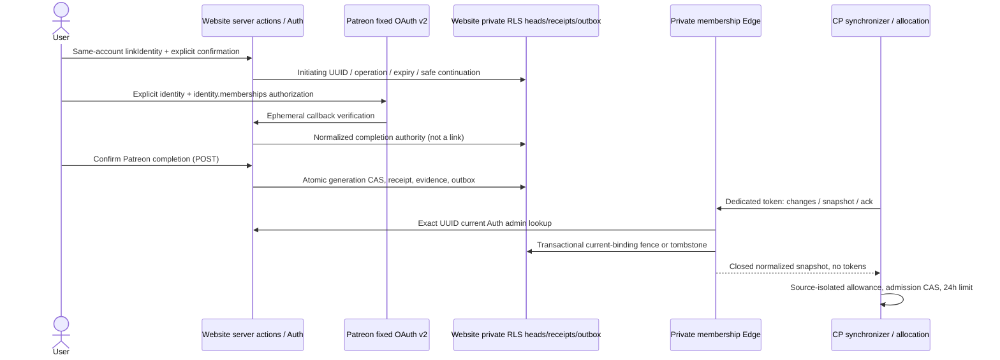

# Source-owned account and membership onboarding (not enabled or deployed)

This composes reviewed website histories `93ab60b` (owner onboarding) and
`e8a6648ca64b8ae0e8cbd43d31620eec720b131f` (Patreon identity linking), without the
separate regional administrator PR95. Backend contract: local `4160f7b` and
`docs/managed-hosting/membership-onboarding.md` in the control-plane repository.

## Subscription-benefit policy, not payment settlement

The parent explicitly approved **Patreon-reported current entitlement**, not
proof that the most recent $20 charge settled. Policy v1 requires the exact
configured campaign and qualifying tier IDs, campaign currency USD, the tier's
reported amount at least 2000 cents, member currently-entitled amount at least
2000, `patron_status=active_patron`, `last_charge_status=Paid`, a nonfuture
last-charge timestamp, and explicitly false free-trial/gift flags. All identity,
member/user, member/campaign and entitled-tier/campaign relationships must be
complete and agree. Marketing names, lifetime contributions, email, and metadata
are never membership evidence.

**Intentional unpaid-upgrade case:** Patreon documents currently-entitled tiers
and amount as including a *current pledge OR a payment covering the current
period*. An upgraded tier already reported entitled while the member remains
active/Paid can qualify before an incremental charge. This is subscription-benefit
policy, **not evidence that $20 was captured**. Independent review must examine
this explicit adjustment to the earlier minimum design's settlement language.

Read-only primary source checked: <https://docs.patreon.com/>, APIv2 Identity,
Member attributes/relationships, Tier relationships, Campaign currency and the
v1→v2 migration guide. `last_charge_date` means last **attempted** charge, not a
paid-through deadline. No paid-through date is available in this adapter's
supported response: `paidThroughAt` is always null. We never request or infer
expiry from `next_charge_date`, pledge cadence, lifetime payment or last charge.
Former/cancelled patrons without independent paid-through evidence are
`review_required`; declined evidence is nonqualifying; missing/ambiguous fields,
pending/unknown charge status, free trials/gifts, duplicate resources and incomplete
pagination require review. Unexpected identity response is a failed authorization.
The adapter deliberately refuses incomplete pages rather than following arbitrary
provider-supplied URLs. This is safe denial, not a claim to support every account.

The fixed identity URL requests `identity identity.memberships`, includes
`memberships.campaign,memberships.currently_entitled_tiers.campaign,memberships.user`,
and explicitly requests the member status/charge/entitled amount/free-trial/gift,
campaign currency and tier amount fields. HTTPS destinations are fixed, redirects
refused, response bodies/counts and request deadlines bounded. Provider access and
refresh tokens exist only during callback processing; no tokens/raw bodies are
persisted or logged. Only normalized evidence and its SHA256 digest are retained.
A crash between code exchange and normalized persistence requires fresh OAuth.
There is **no unattended Patreon polling or token refresh**.

Positive evidence lasts at most 24 hours and funds only **new allocation**.
`max(administrativeBase, qualifyingPatreonOne) + administrativeBonus` is the backend
reducer; never add an extra membership slot to an existing administrative base.
Administrative suspension remains authoritative. Adequate independent grants bypass
membership outages/configuration. Expiry/unlink/unknown evidence never Stop, delete,
revoke administrative grants, transfer servers, or start a grace countdown. Existing
owner Start/Stop/saves remain accessible. Beginning a new Patreon check invalidates
old positive evidence immediately, including cancellation or provider outage.

## Same-account flow and recovery

1. Sign in or sign up normally, retaining the intended website account. `/servers`
   inspects current Auth provider identities **before requesting CP allocation**.
   Missing Discord offers **Confirm and connect Discord**; it uses Supabase
   `linkIdentity`, never `signInWithOAuth`, an email match or automatic account merge.
2. A server-held random-token request records initiating UUID, operation UUID, safe
   `/account` or `/servers` continuation and a ten-minute expiry. Its reference is
   in a Secure, HttpOnly, host-only cookie. Supabase owns its own OAuth state/PKCE;
   application code does not replace them. The callback checks the current UUID
   against the server request before exchanging the code and verifies the same UUID
   afterward. Only after successful same-UUID exchange, the existing server-only
   `getSupabaseAdminClient` seam writes an exact token/account/operation callback
   marker. This requires the existing `SUPABASE_SECRET_KEY` on the website server;
   missing configuration fails closed before code exchange. The fixed callback RPC
   is service-role-only; browser JWTs cannot stamp a marker from Auth linkage.
   Explicit confirmation requires the marker, current authoritative Discord,
   unchanged callback generation and live original authority. The first marker
   also CAS-checks the initiation generation before current-Auth fencing. A parallel
   background status that fences the newly connected identity (or a Patreon begin/
   unlink) can therefore supersede this attempt before the marker is written. This
   conservative refusal does not disconnect Auth or remove independent grants:
   resolve/cancel the uncommitted attempt and continue using the valid connection.
   No seamless OAuth success under that race is claimed.
   Supabase may establish the identity during its own OAuth callback after the
   user's initial explicit approval; return confirmation never fabricates identity.
3. Disabled manual linking, cancellation, missing/expired cookie, conflicting
   provider identities, forwarded callback or account change fail into repair.
   Separate pre-existing accounts require support. Never solve them by switching
   to sign-in, guessing identity by email or transferring CP ownership.
4. Patreon launch/state are single-use, hashed and browser-cookie bound. Operation
   UUID, expected generation and server-held continuation travel through state.
   Provider callback GET creates only normalized completion authority; the website
   callback GET puts its token in an HttpOnly cookie and removes it from the URL.
   **Authenticated explicit POST confirmation** commits the link and evidence.
5. One SQL transaction validates initiating UUID, generation and expiry, consumes
   completion authority, updates the globally unique Patreon binding, increments
   revision, writes an immutable receipt and inserts an outbox hint. Lost responses
   retry the same token and recover the committed receipt, even after evidence
   expiry/unlink. Recovery reports the historical operation, not a current positive
   status, and never relinks. A different user cannot consume or recover it.
   Keep pending cookies on uncertain responses, but do not rely on their survival.
   One durable, non-authorizing recovery slot per account/provider stores the exact
   operation, hash, generation, expiry and safe continuation (no raw OAuth token).
   Discord begin and Patreon completion issuance persist this slot atomically.
   Authenticated status renders retained recovery on throttle/reload/bare `/account`.
   A missing cookie or unverified callback cannot be replaced by the UUID or current
   Auth identity. Explicit cancellation serializes with completion: a winning commit
   returns its historical receipt; otherwise cancellation fences/deletes ephemeral
   authority. Acknowledged committed slots survive response loss until a later
   explicit begin replaces them; immutable receipts/confirmed history never expire.
   A live/unknown attempt blocks replacement. An expired uncommitted attempt can be
   explicitly resolved, then restarted if Auth is unlinked. An already connected
   Discord remains usable for Servers/Patreon without falsely reporting the expired
   attempt committed; fresh OAuth for an already-linked provider is not promised.
   If a confirmed Discord slot no longer matches authoritative current Auth (including
   unlink), recovery returns `historical`, with no receipt or confirmation authority.
   Exact same-account resolution only acknowledges that reference and returns `retired`;
   it never restores identity, grants or original confirmation history. An already
   acknowledged slot is also `retired` under mismatch. Both states expose explicit
   retirement; cookie-free lost-response retries remain idempotent. Only `retired`
   plus currently unlinked Auth permits a new explicit begin. A valid different
   current Discord can continue normally without claiming the old attempt is current.
   A new begin replaces the acknowledged slot; old/foreign/unknown operation resolution
   cannot clear it. Retirement leaves browser cookies untouched so a delayed response
   cannot erase a newer authority. Successful confirmation/receipt-as-current replay
   still refuses mismatched Auth. No Auth unlink or automatic account merge is performed.
6. `/account` shows a server-authenticated current status, never success inferred
   from query parameters. **Refresh status** reads durable state/sync; **Check again**
   initiates new OAuth. `/servers` retains exact-UUID sessionStorage mutation recovery
   ahead of membership prompts, preserves current-session completion fences, and
   separates **owned** cards from **associated** manager/support/admin cards.

Full regions remain selectable for persistent Request, without reservation or ETA.
Create remains stopped; first Start uses the bundled default save. Password controls
remain the documented Discord owner path, not a new web password endpoint.

## Exact closed contracts and storage ownership

Private endpoint (no browser/CORS authority):
`POST https://wfvqnijwuyqjibhlcrhz.supabase.co/functions/v1/control-plane-membership-v1`.
`Authorization: Bearer <64 lowercase hex>` is a **dedicated** synchronization
credential, not a service-role key. The verifier uses a full fixed-length digest
comparison. Only strict v1 `snapshot({accountId})`, `changes({cursor,limit<=50})`,
and `ack({eventId,receiptId})` envelopes exist. Unknown fields/operations fail.
Every snapshot authoritatively looks up the exact account via Auth admin API;
404 becomes a tombstone, outage fails closed, identities never fall back to metadata.
Patreon is a website-owned binding, not a Supabase provider identity.

`membership.ts` contains the exact private snapshot contract (all keys required,
nullable semantics, decimal strings, provider ID bounds, UTC millisecond times).
It matches CP `membership-contract.ts`. `server-onboarding-contract.ts` parses CP
allocation **version 2**, including source breakdown and freshness, retaining all
six ordered regions. No private provider IDs enter the public account status or
website summary. `membership-onboarding.ts` owns strict authenticated status parsing
and public summary v2 status/next-action composition.

Website migration: `202609080002_membership_onboarding.sql`, **after** backend
`202609080001_control_plane_membership_sources.sql`. No applied migration is edited;
`20260907212654_create_patreon_links.sql` remains byte-identical to merged PR103.
Four new public-schema tables are RLS enabled and client grants denied:
`membership_heads`, `membership_outbox`, `membership_completion_receipts`,
`discord_link_requests`. Heads, receipts and outbox have no cascading Auth FK.
An Auth BEFORE DELETE trigger records a preserved tombstone before legacy OAuth/link
rows cascade. Existing identity-only links migrate as unverified, never paid evidence.
New server RPCs use fixed empty search paths, service-role-only EXECUTE and no
browser grants. Service role has no direct new-table privileges; narrow functions
own writes. Existing private OAuth states gain operation/generation/return/evidence
columns. Do not use legacy handlers with new membership enablement.

Each new explicit verification also advances generation, preventing an older OAuth
completion from overwriting a newer check. Verification-pending state is distinct
from outbox synchronization-pending state. Binding fences hold short SQL locks and invalidate evidence on observed Discord or
Patreon changes. Explicit unlink fences even an in-flight initially-unlinked flow.
A global membership-outbox advisory lock serializes writer commit order so a cursor
cannot skip a lower uncommitted sequence. Pages are bounded ascending hints, not
stale grant payloads. Ack binds the first receipt forever; exact replay succeeds,
changed receipt conflicts. Restart from a null cursor returns remaining pending
hints. Known binding reconciliation is an Auth check, not a Patreon refresh.
No retention/cleanup policy for durable receipts/tombstones is introduced.

## Configuration and rollout blockers

Nothing here provisions credentials, applies SQL, changes Auth/Patreon settings,
deploys Edge/Cloudflare/CP, pushes or merges GitHub. Membership remains disabled
without reviewed configuration. No actual campaign or tier ID was invented.

Required reviewed runtime configuration:

- Existing Edge Patreon client ID/secret, exact HTTPS callback URI and canonical
  `PATREON_SITE_URL`. These remain Edge-only; never put them in Cloudflare/browser.
- Edge `HOSTING_MEMBERSHIP_POLICY_JSON`: strict `campaignId`, unique 1–50
  `qualifyingTierIds`, `currency:"USD"`, `minimumCents:2000`,
  `policyVersion:"patreon-paid-usd20-v1"`. Absent => no membership verification.
- Edge dedicated `HOSTING_MEMBERSHIP_SYNC_TOKEN`; CP receives the same scoped value
  through its separate owner-only encrypted systemd credential, **not** Supabase
  service-role authority. CP also requires its default-off membership enable flag,
  pinned origin and identical policy mapping.
- Website server-only `ACCOUNT_LINK_SITE_URL` = canonical HTTPS origin. No caller
  headers determine the Discord callback destination. Existing public Supabase
  URL/publishable key must be correct at runtime and for browser bundles.
- Supabase manual identity linking enabled, Discord provider enabled, exact
  `/account/discord/callback` allowlisted, registered Discord→Supabase callback
  correct, Patreon scopes and exact callback registered. No live setting changed.

Deployment gates: parent/reviewer approves policy and exact bytes; coordinates the
**complete chronological shared migration union and byte pins in both repositories**;
additive backend migration then application with feature disabled; website migration;
deploy updated Patreon/my-servers/website-account/private Edge functions; provision
scoped credentials and reviewed settings; deploy website; prove real HTTPS
browser→Auth→Edge→CP with controlled accounts, identity switches, outages and replay;
only then explicitly enable membership policy. The dedicated private function alone
uses custom token verification; existing browser JWT functions still validate Auth.
Applications never apply migrations automatically. The historical mirror alone is
not evidence of deployed migration history. No unknown-file/include-all bypass.

## Local evidence versus production proof

Automated provider/API fixtures are synthetic; React/route tests mock Auth and Edge.
Real isolated PostgreSQL tests apply the unchanged populated Patreon baseline and
new migration, exercise RLS, injected rollback, competing completions, expiry,
identity changes, uniqueness, unlink/replay, outbox ack/restart and deletion tombstones.
No test supplies real OAuth membership, a production account, credentials, gameplay,
container commissioning or UDP reachability. Real browser HTTPS integration remains
blocked by reviewed runtime policy, credentials, callback/manual-link settings and
separate deployment authorization. Never disable TLS verification to claim it.

Reproduce: `npm test`, `npm run test:membership:postgres` with only an owned isolated
loopback fixture URL, `npx next typegen && npx tsc --noEmit`, focused changed-file ESLint,
credential-free Next and `WORKERS_CI=1` OpenNext builds. The PostgreSQL suite refuses
non-loopback or non-fixture database names and otherwise explicitly skips without
its fixture URL. Tests do not relax legacy UUID/session recovery or full-region UI.

## Bounded account mutations and revocation delivery

These are technical abuse limits, not membership business policy: at most **10 new
ordinary mutations per account per 10-minute window**, **4 live pending authorities**
across Patreon and Discord, **8 ordinary unacknowledged hints**, plus **1 reserved
revocation hint**. Begin and first completion consume ordinary budget; authenticated
exact completion/confirmation replay does not. Pending OAuth insertion is locked and
generation-checked even during callback replacement, so a consumed token cannot be
reissued after unlink. Only expired/superseded ephemeral authority is cleaned; durable
completion receipts, acknowledged events and confirmed Discord requests are retained.
The closed public throttle is HTTP429, JSON `{"error":"membership_rate_limited"}`.
There is no `Retry-After`: outbox delivery has no deterministic admission deadline.
Refresh authenticated recovery before retrying. Ten-minute OAuth authority is never
extended, and waiting cannot guarantee admission. Expired uncommitted attempts offer
explicit safe resolution rather than an impossible ten-minute retry promise.
Confirmed Discord receipt replay, like Patreon, precedes expiry and ordinary admission
while preserving account/current-identity fences. First Discord confirmation must
write the exact account/operation/hash row before its original exclusive deadline and
assert `RETURNING` plus the recorded confirmation timestamp before returning success.
If admission cleanup deletes the request or the deadline crosses inside the RPC, an
exception rolls back all admission, cleanup, head/outbox and receipt effects. Fixture-only
PG triggers cross that deadline at window reset and after cleanup; production has no
clock override or expiry extension. PG-backed mounted actions exercise synthetic Auth
unlink/change, both acknowledgment states, lost retirement responses and explicit restart;
this is not real browser OAuth/JWT or deployed Edge evidence. The partial
`discord_link_requests_pending_account_expiry` index excludes retained confirmed
history from account/expiry admission scans. Local PostgreSQL EXPLAIN regressions
populate 50,000 confirmed rows without forcing the optimizer's scan choice.

Unlink, current-Auth fencing and Auth deletion must remain safe at budget. Redundant
unlink does not advance an already empty, unlinked head, but real pending authority
(including a temporarily consumed OAuth row's unknown generation) is fenced. It deletes
pending Patreon authority, invalidates evidence and uses reserved revocation capacity.
With all 9 hints pending, revocation advances the durable head without rewriting any
hint or receipt. At least one deliverable unacknowledged hint necessarily survives.
Every ACK, including retry/out-of-order ACK, takes the global commit-order/account locks
and atomically ensures a hint for the **newest head** exists after acknowledging the old
hint. A missing successor is inserted with a strictly newer cursor, within the 9-hint
bound. If insertion fails, the ACK rolls back. An already acknowledged newest-head hint
satisfies delivery; no duplicate is generated. Tombstone repair does not require Auth
or resurrect a deleted account. CP must acknowledge only applied snapshot receipts.
Status remains pending while any unacknowledged hint survives, including deferred wake.

This bounds per-account durable admission/backlog; it is **not global volumetric-abuse
prevention**. Historical receipts remain monotonic and retained, not pruned to satisfy a
space quota. Existing server access, administrative grants/revocation, current-binding
CAS and exact-UUID Create recovery are unchanged.

## Shared history: fixed representations, upgrade only

The exact 22-version inventory is pinned in
[`membership-migration-inventory.json`](membership-migration-inventory.json).
It records canonical LF Git SHA256/byte counts and ownership for every own file,
companion source HEAD `4160f7bda49c6dd7dab57b912811c793dec90ac3`, and the fixed ten
historical representation pairs. All pre-existing website paths and committed bytes
are unchanged, including the old Patreon migration. Ten previously missing,
noncolliding CP migrations through `202609080001` are exact committed Git-byte mirrors.
`202609080002` is website-owned **new pending release SQL**, not already-applied external
history; its final pin must be added to CP's coordinated release catalog.

The ten historical exceptions (versions21074242/21083000/21100640/21112235 on202608,
202608240001, and202608260001–260005) are explicitly **different historical
representations of the same version, not SQL-equivalent aliases or authenticated
remote SQL**. Four early public-history pairs are both markers; website240001 and
260004–5 are actual server-settings/nightly SQL versus CP markers; website260001–3 are
markers versus CP private-schema/runtime-role/audit-sequence SQL. The JSON pins both
paths/hashes/byte counts. Fresh review must inspect this fixed matrix rather than
relax a helper to accept arbitrary aliases.

Supported deployment is **upgrade only via CP's coordinated release**, with its own
exact baseline inventory/pins unchanged and baseline already applied. Do not use
arbitrary website `supabase db push`, reset, migration repair, or replay markers to fill
missing baseline. A fresh bootstrap is unsupported/unproved by these history markers.
The website's version union does not prove remote applied state. Next backend stage
must pin the final website080002 bytes as pending, preserve its own exact catalog and
unknown/external-replay refusals, and test real isolated CLI pre-application, partial
and terminal release histories. No remote history was read or altered in this fix.
