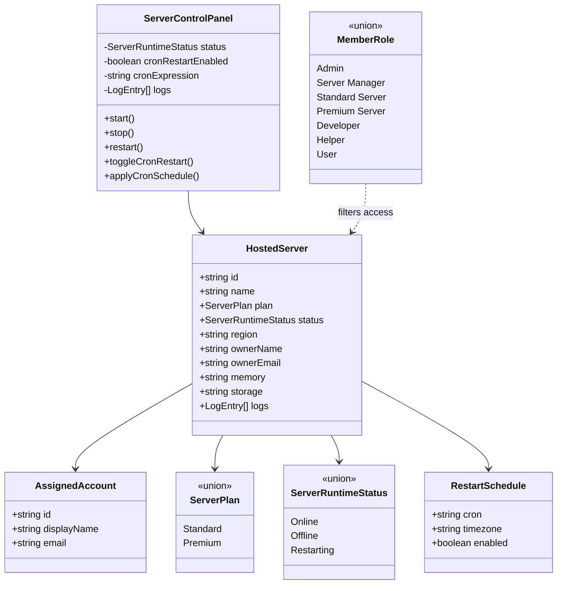

# Placeholder Server Hosting Management

## Required behavior

- Add `Server Manager`, `Standard Server`, and `Premium Server` member roles alongside the existing roles.
- Allow Admins and Server Managers to view the complete hosted-server list.
- Associate every placeholder server with an account and show the account name, email, and identifier in staff fleet and management views.
- Give Standard Server and Premium Server members a role-appropriate view of their own placeholder server.
- Keep the server directory public while protecting owned-server data and individual management routes on the server.
- Provide start, stop, and restart controls and a live-looking log console.
- Provide an accessible toggle for each server's placeholder cron restart schedule and reveal its editable five-field cron expression only while enabled.
- Keep all server state, schedule settings, and control operations explicitly simulated until VPS infrastructure exists.
- Preserve the existing Supabase member-role administration flow and site visual language.

## Minimum-complexity design

Use typed, in-process placeholder records rather than adding a database or API prematurely. Each record includes a typed placeholder account assignment that is exposed only in Admin and Server Manager fleet views. Server Components enforce role access and select the records a member may see. A single Client Component owns temporary control state, the cron-restart toggle and editable expression, and simulated logs; refreshing resets them. A later infrastructure adapter can replace the placeholder repository, account assignment source, and client simulation without changing the routes or page composition.

## Type relationships



## Dependency flow

```mermaid
flowchart LR
    Supabase[Supabase Auth session] --> Access[Role/access helpers]
    Placeholders[Typed placeholder server records] --> ListPage[/servers Server Component]
    Placeholders --> DetailPage[/servers/[serverId] Server Component]
    Access --> ListPage
    Access --> DetailPage
    ListPage --> DetailPage
    DetailPage --> Controls[ServerControlPanel Client Component]
    Controls --> Simulation[Local status and log simulation]
    FutureInfra[Future VPS control adapter] -. replaces .-> Placeholders
    FutureInfra -. replaces .-> Simulation
```

## Dormant IONOS adapter

A provider-backed IONOS adapter and management UI are retained for possible future use, but they are disabled by default while alternative hosting options are evaluated:

- `/servers` does not call the IONOS inventory API or render the IONOS panel unless `IONOS_MANAGEMENT_ENABLED=true`.
- The create-server Server Action rejects direct requests before contacting IONOS unless management and `IONOS_SERVER_CREATION_ENABLED=true` are both enabled.
- Provider mutations reauthenticate the Supabase user and restrict billable actions to Admins.
- Provider identifiers and website ownership markers are validated before requests can address resources.

The separately hosted live Bannerlord console is not part of the placeholder repository or dormant IONOS adapter. Its architecture is documented in `docs/live-server-console-design.md`.

## Acceptance checks

- Role parsing and defaulting still work with all new roles.
- Admin and Server Manager access helpers return staff-level server access.
- Standard and Premium roles receive customer server access; unrelated roles do not.
- Server list and detail routes compile and enforce authentication/authorization server-side.
- Staff fleet and management views show a distinct account assignment for each server.
- Management controls visibly update local status and append simulated logs.
- The cron-restart switch toggles locally, reports its state accessibly, and appends a simulated log entry.
- The editable cron field is hidden while disabled, validates a five-field expression, and applies changes locally while enabled.
- The UI clearly labels placeholder data and unavailable infrastructure.
- `npm test`, `npm run lint`, and `npm run build` pass.
