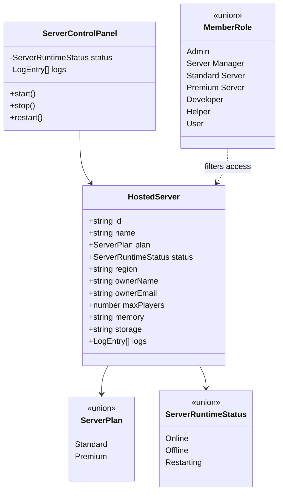

# Placeholder Server Hosting Management

## Required behavior

- Add `Server Manager`, `Standard Server`, and `Premium Server` member roles alongside the existing roles.
- Allow Admins and Server Managers to view the complete hosted-server list.
- Give Standard Server and Premium Server members a role-appropriate view of their own placeholder server.
- Protect both the server list and individual management routes on the server.
- Provide start, stop, and restart controls and a live-looking log console.
- Keep all server state and control operations explicitly simulated until VPS infrastructure exists.
- Preserve the existing Supabase member-role administration flow and site visual language.

## Minimum-complexity design

Use typed, in-process placeholder records rather than adding a database or API prematurely. Server Components enforce role access and select the records a member may see. A single Client Component owns temporary control state and simulated logs; refreshing resets it. A later infrastructure adapter can replace the placeholder repository and client simulation without changing the routes or page composition.

## Type relationships



## Dependency flow

```mermaid
flowchart LR
    Supabase[Supabase Auth session] --> Access[Role/access helpers]
    Placeholders[Typed placeholder server records] --> ListPage[/servers Server Component]
    Placeholders --> DetailPage[/servers/[serverId] Server Component]
    Access --> ListPage
    Access --> DetailPage
    ListPage --> DetailPage
    DetailPage --> Controls[ServerControlPanel Client Component]
    Controls --> Simulation[Local status and log simulation]
    FutureInfra[Future VPS control adapter] -. replaces .-> Placeholders
    FutureInfra -. replaces .-> Simulation
```

## Acceptance checks

- Role parsing and defaulting still work with all new roles.
- Admin and Server Manager access helpers return staff-level server access.
- Standard and Premium roles receive customer server access; unrelated roles do not.
- Server list and detail routes compile and enforce authentication/authorization server-side.
- Management controls visibly update local status and append simulated logs.
- The UI clearly labels placeholder data and unavailable infrastructure.
- `npm test`, `npm run lint`, and `npm run build` pass.
