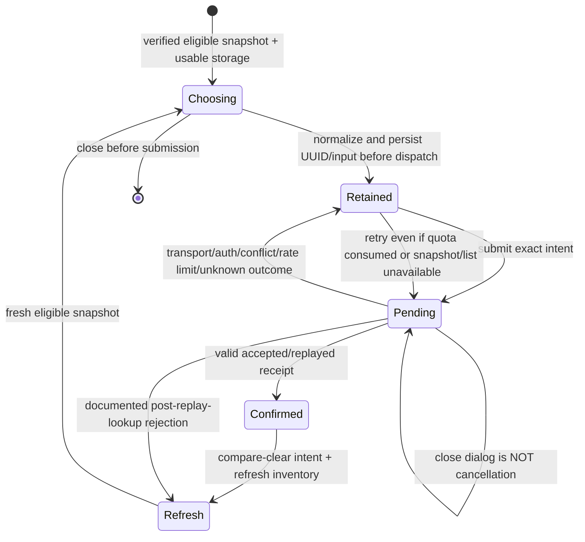
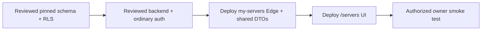

# Website server onboarding

Real `/servers` onboarding adapts the approved gold/dark modal design (`f4eeb2d`) onto the current directory. It does not replace the page with the development mock or use browser database writes. Membership is verified server-side under the explicit policy in [membership onboarding](membership-onboarding.md). Existing live-console and managed-server inventory/credentials/controls are unchanged.

## Authority and public contract

The backend requires active, unused allocation under `max(administrativeBase, qualifyingPatreonOne) + administrativeBonus`. Membership is disabled until the reviewed configuration/rollout gates in the membership document pass. Roles (including Admin, Standard and Server Owner) and historical role grants do not authorize this feature. The authenticated backend derives the guild and verified linked Discord identity; website-supplied page identity only prevents dispatch after an account switch.

| Website Edge request | Fixed backend operation | Exact backend input |
| --- | --- | --- |
| `GET my-servers?resource=onboarding` | `server-onboarding` | `{}` |
| `POST my-servers` `{action:'create-server',displayName,region}` | `create-server` | `{displayName,region}` |
| `POST my-servers` `{action:'request-region',region}` | `request-region` | `{region}` |

All use existing Supabase JWT forwarding to authenticated `POST /v1/user/control-plane`, `{version:1,requestId,operation,input}`. Mutations require a caller-generated UUID in `x-request-id`, normalized to lowercase. There is no browser service secret or owner/role/host/build/slot selection. Adequate independent administrative grants bypass membership steps; an administrator role alone is not allocation authority. New membership runtime configuration is documented separately. The shared closed DTO parser is used by **both** Edge and website facade. Unknown enums, extra/private fields, missing fields, inconsistent eligibility, wrong regions/names, invalid timestamps, mismatched receipts/envelopes and inconsistent HTTP success/failure are rejected as unavailable, not displayed as safe data.

Canonical order: **US-West, US-East, France, Germany, United Kingdom, Poland**. Name policy matches backend raw 3–48 UTF-16 code units, then NFKC, trim and whitespace collapse, normalized 3–48 policy. Letters/numbers at both ends; letters/numbers/spaces/periods/apostrophes/hyphens inside. Region requests do not send a name.

Both new mutations require `eligibility.eligible && unavailableReason === null`. Availability is advisory. Available regions offer Create; full regions remain selectable and offer Request, or display their existing outstanding request. Summary failure is **unknown/unavailable**, not evidence of entitlement or full capacity. Inventory failure is independent of onboarding/recovery.

```mermaid
sequenceDiagram
    actor Owner
    participant UI as /servers + native dialog
    participant Action as Verified server action
    participant Edge as my-servers Edge
    participant Backend as User boundary / owner workflow
    participant DB as Private Supabase persistence
    Owner->>UI: Name + canonical region
    UI->>UI: Persist normalized exact intent + UUID in sessionStorage
    UI->>Action: Intent + expected page user
    Action->>Action: getUser + session; compare page user (restriction only)
    Action->>Edge: Current Supabase JWT + fixed input + UUID
    Edge->>Backend: Strict /v1/user/control-plane envelope
    Backend->>Backend: Verify JWT + linked Discord + source-owned allocation
    Backend->>DB: Exact replay or atomic assignment / region request
    DB-->>Backend: Durable receipt
    Backend-->>Edge: Closed safe DTO
    Edge-->>Action: Validated safe DTO
    Action-->>UI: Confirmed receipt (not live lifecycle)
    UI->>UI: Compare-clear resolved intent; refresh actual My Servers
```

## Results and recovery

Create reserves/assigns an existing prepared slot and creates a **stopped** server. It does not purchase infrastructure, provision, or start it. The receipt says **Server assigned**, not running/ready. Current lifecycle comes from the refreshed managed inventory/manage page, not the historical receipt. Defaults: verified Stable, maintenance **03:00–04:00 America/Chicago**, existing standard configuration. First Start uses the bundled default save; no import is required.

**Password limitation:** Manage your game password through the existing Discord owner controls: **My Servers → choose server → Settings / Configure your server → Custom game password (optional)**. Enter a new custom password and submit. Blank preserves the generated password that cannot be read from this website. Discord does not mask this input or echo the submitted password. Do not direct owners to the administrator-only Generate Password action.

Region requests are private durable backend writes. One outstanding owner+region request deduplicates even different UUIDs. The returned request UUID may therefore differ from the submitted envelope UUID. Summary reload displays existing requests. Requests consume **no quota** and create **no server, reservation, job, email or notification**; no ETA or automatic capacity/allocation is promised. They remain outstanding if capacity arrives or a server is subsequently created.

Recovery follows the existing managed-server-backup pattern, with one pending onboarding intent per authenticated website account in **sessionStorage**. Exact action/name/region/UUID is written and read back before dispatch; there is no expected generation field in this backend contract. Concurrent double clicks are synchronously guarded. Corrupt/inaccessible storage blocks mutations. Account-keyed remounting separates identity state, and exact compare-clear prevents late responses deleting newer intents.



`request_conflict`, `rate_limited` (HTTP409 or429), auth/account-switch errors, invalid responses and unknown failures **retain the exact intent**, irrespective of retryable flags. They cannot establish whether an earlier attempt committed. Only documented post-receipt-lookup workflow rejections (`capacity_unavailable`, `capacity_available`, `quota_exhausted`, provider/approval/pilot/pause/build unavailability) release an intent and force a fresh snapshot before another choice. The backend handoff/source was checked for this ordering. Re-evaluate this policy if backend replay ordering changes.

Retry remains available outside the modal even after list/eligibility changes. Closing a pending modal does not abort or pretend to cancel the request. Native `showModal()` makes the background inert; explicit Tab edge wrapping, Escape close, result focus, scroll containment and focus restoration support keyboard use. **Do not clear sessionStorage, replace the UUID or close the browser tab to resolve an uncertain outcome.** SessionStorage survives reload/account switching in the same tab, not closing the tab or moving devices. If storage is lost/corrupt or access is revoked, reconcile through supported backend/operator procedures before any replacement request; no browser-side quota inference proves non-commit.

## Ordered rollout — separate authorization required

No deployment or migration was performed by this website lane. Review backend HEAD `8b70c7ab5e2b3b39d5519afaae47fea29bde1048` and `docs/managed-hosting/owner-onboarding.md` there.

1. Obtain separate live-operation authorization and plan the exact-catalog application/schema maintenance boundary.
2. Apply backend's pinned append-only schema migrations in order using the supported migration workflow: `202609030001_control_plane_regions.sql`, then `202609070001_control_plane_owner_onboarding.sql` (private requests/receipts/admission locks). Review RLS/runtime-only grants. Do not improvise old/new application restarts across incompatible catalog expectations.
3. Deploy reviewed **backend** by its normal serialized workflow and verify the authenticated user boundary/explicit grant behavior. Preserve provisioning OFF, role-triggered deletion OFF and idle VM stopping OFF; existing approvals/profile/build prerequisites remain required.
4. **Deploy the `my-servers` Supabase Edge Function and its shared modules before the UI.** Verify all three fixed operations and closed safe response/error forwarding with normal verified JWT/Discord linkage. This step is essential: a previous feature failed because the Edge function was not deployed.
5. Deploy website UI only after the Edge contract is available. Smoke-test with separately authorized test accounts/capacity through ordinary APIs. Keep safe unavailable UI if any earlier layer is absent.

No direct database edits, service-secret browser configuration or administrator role workaround are part of rollout/testing.



## Validation and reproduction

```sh
npm ci
npm test
npx next typegen
npx tsc --noEmit
# Safe build wrapper: allowlisted environment, JS outbound fetch blocked; includes postbuild.
node tests/onboarding-offline-build.mjs
# Explicit mock-only browser check: fresh owned profile and loopback43187, fails if occupied.
node tests/onboarding-browser.mjs
```

The browser command must be separately authorized where local processes are gated. It requires installed Edge on Windows or an explicitly approved Chromium executable via `ONBOARDING_CHROMIUM`. It copies exact real component/intent/DTO/directory/CSS sources into ignored `node_modules/.onboarding-browser/source`, adds **only there** the fixture route and synthetic mutation function, and uses a credential-free environment. Production source has no fixture auth/API routing. It owns/stops its Next/browser process trees and removes its fresh profile/home. The retained source and sanitized server log enable inspection. It blocks remote **page** requests using CDP; resolver/background-networking flags are not a proof of browser-internal zero egress. Screenshots use fallback fonts because the harness intentionally omits remote Google-font fetching; production retains its unchanged font layout.

Tests distinguish:

- **Real in-process facade → real strict Edge → synthetic upstream**, including UUID, JWT forwarding, complete DTO validation and HTTP errors. This is not a real backend or Supabase JWT verification test.
- Mounted **real UI and real server actions**, with auth/facade dependencies mocked, covering create/request/validation/eligibility, uncertain exact retries/reload, account mismatch, storage failure, terminal/transitional inventory and late response safety.
- Real page composition with mocked external dependencies preserves mixed live-console/managed inventory, public placeholder labeling and unavailable onboarding behavior.
- **Mock-only browser integration**: native desktop/mobile dialog, Tab/Escape/restore, create stopped inventory, requested summary reload, capacity race, uncertain retry after reload/consumed quota/account mismatch/switch. No end-to-end production TLS, JWT, Discord linkage, Supabase persistence, backend assignment or game start is proved by these browser checks.

Known baseline full lint failures are only `src/app/cheats/CheatsDirectory.tsx:229` and `src/app/cheats/CheatsView.tsx:40` (`react-hooks/set-state-in-effect`), verified byte-identical to base `84530ab`. Focused changed-file lint passes. Ordinary Windows tests skip the existing Linux installer subprocess test; no skip predicate was changed.

**Validation incident:** the first unmodified `npm run build` succeeded but the existing static changelog fetch attempted GitHub and logged HTTP401. This was not intended live validation and was reported immediately. A subsequent credential-free build used the explicit JS-fetch-blocking wrapper and passed; its expected blocked changelog message is retained. Initial Chrome fixture setup rejected remote debugging despite an explicit fresh profile and emitted browser-internal registration errors; it was stopped, and only the separately approved Edge fixture was used for successful screenshots. Do not describe these runs as full network-isolation proof or as a no-network-call history.

## User test checklist (mock-only screenshots)

All images below are **synthetic auth/API**, not real backend results. The banner is visible only in the eligible fixture; full regions stay selectable. On narrow screens the dialog scrolls vertically, without horizontal page overflow.

1. Eligible unused quota: open setup by keyboard; inspect all six regions. Try invalid punctuation or a short name: no dispatch; correction normalizes whitespace.
2. Create US-West: receipt says assigned/stopped at creation, includes a real-shaped manage URL and Discord password notice. The mock inventory refreshes Offline; it is not running evidence.
3. Select France (full), with no name: Request; confirmed outstanding summary persists on reload; choosing it again shows an existing request instead of a fresh mutation.
4. Simulate capacity race: no-change message; stale snapshot cannot submit until refreshed.
5. Simulate lost response: close/reload, consume quota, change current auth or switch page account. Original account retains an accessible exact retry. Replayed success clears only that exact intent.
6. On mobile390×844 and desktop1440×1000: native dialog has focus containment, Escape closes, trigger/fallback focus restores, and closing while pending does not claim cancellation.

| Screenshot | Mock-only evidence |
| --- | --- |
| [Desktop banner](server-onboarding/mock-desktop-banner.png) | Approved design adapted to explicit quota |
| [Desktop dialog](server-onboarding/mock-desktop-dialog.png) | Name and six selectable regions |
| [Desktop assigned](server-onboarding/mock-desktop-assigned.png) | Historical stopped receipt/password limitation |
| [Desktop requested](server-onboarding/mock-desktop-requested.png) | Durable-shaped private request confirmation |
| [Capacity race](server-onboarding/mock-desktop-capacity-race.png) | Safe stale snapshot rejection |
| [Recovery](server-onboarding/mock-desktop-recovery.png) | Retry persists through account mismatch/consumed quota |
| [Mobile banner](server-onboarding/mock-mobile-banner.png) | Responsive layout |
| [Mobile dialog](server-onboarding/mock-mobile-dialog.png) | Scrollable two-column region grid |
| [Mobile requested](server-onboarding/mock-mobile-requested.png) | Confirmed request without guarantees |

Independent reviewer acceptance is still required. Full-stack browser/backend testing, live rollout, database/provider changes, push/PR/merge and deployments remain out of scope without separate authorization.
