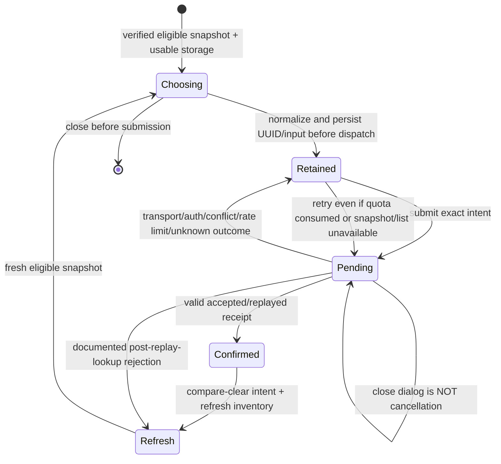
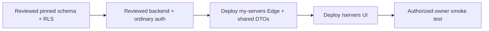

# Website server onboarding

Real `/servers` onboarding adapts the approved gold/dark modal design (`f4eeb2d`) onto the current directory. It does not replace the page with the development mock or use browser database writes. Membership is verified server-side under the explicit policy in [membership onboarding](membership-onboarding.md). Existing live-console and managed-server inventory/credentials/controls are unchanged.

The directory starts public inventory independently and streams navigation,
private inventory and hosting status in separate sections. Each render verifies
one user/session pair and shares that render's client with the account-status
reader and its verified user with navigation. There is no cross-render user or
session cache. The owner inventory read uses the refreshed session token while
fresh viewer checks run; its API independently authenticates that token and current
authority. The page releases inventory only after matching user/session
verification. Rejected or mismatched viewers cancel the read and any later pages.
Account-status and onboarding requests still follow viewer verification,
authenticate the explicit token and validate current session context. Account
synchronization precedes allocation reads, without delaying either directory.
The server-rendered onboarding summary uses the existing fixed Oracle user API
directly, removing the Edge relay for this closed read only. It uses the same
strict summary parser with a 64 KiB streamed response limit, a 30-second deadline,
no response cache and no redirect following. Browser reads and all mutations
retain their existing Edge route; failed summary reads remain unavailable.

## Authority and public contract

The backend requires active, unused allocation under `max(administrativeBase, qualifyingPatreonOne) + administrativeBonus`. Membership is disabled until the reviewed configuration/rollout gates in the membership document pass. Roles (including Admin, Standard and Server Owner) and historical role grants do not authorize this feature. The authenticated backend derives the guild and verified linked Discord identity; website-supplied page identity only prevents dispatch after an account switch.

| Website Edge request | Fixed backend operation | Exact backend input |
| --- | --- | --- |
| `GET my-servers?resource=onboarding` | `server-onboarding` | `{version:3}`, then `{}` if rejected as `invalid_request` |
| `POST my-servers` `{action:'create-server',displayName,region,releaseChannel?}` | `create-server` | `{displayName,region,releaseChannel?}` |
| `POST my-servers` `{action:'request-region',region}` | `request-region` | `{region}` |

The `my-servers` Edge Function and the server-rendered summary read build these requests with the same exported builders (`onboardingSummaryRequest`, `onboardingMutationRequest` in `server-onboarding-contract.ts`). Owner requests carry region **keys only**; a browser-supplied `placement` or any other extra field is rejected before dispatch.

**Rollout fallback.** A control plane that predates the stored catalog rejects `{version:3}` as `invalid_request`. Every summary read (the server-rendered page, the Edge `resource=onboarding` route and the Edge region-full check) then repeats the read with the version-2 input `{}` through the shared `readOnboardingSummary`, parses the version-2 summary strictly (its six fixed regions in order with their fixed labels) and maps it to the version-3 shape with no `otherRequests`. Any other rejection or failure is not retried. Key-only Create and Request need no fallback: the older control plane accepts the same inputs for those six keys. `readOnboardingSummary` tells each read whether it is the `"current"` or `"legacy"` attempt; the Edge gives the fallback read its own request ID, and each fallback writes one structured warning, `{"event":"onboarding_summary_legacy_fallback","surface":"edge"|"website",…}`, with no token, account or request data.

**Removing the fallback.** Delete it once the control-plane release containing migration 096 (`20261009120000_control_plane_provider_regions.sql`) is live in production; a fallback log line after that means a control plane is still on an older release. The authoritative list of what to delete is the "Version-2 rollout fallback" block in `supabase/functions/_shared/server-onboarding-contract.ts`. It includes rewriting deploy-order step 1 below to "deploy the control plane first".

All use existing Supabase JWT forwarding to authenticated `POST /v1/user/control-plane`, `{version:1,requestId,operation,input}`. Mutations require a caller-generated UUID in `x-request-id`, normalized to lowercase. There is no browser service secret or owner/role/host/build/slot selection. Adequate independent administrative grants bypass membership steps; an administrator role alone is not allocation authority. New membership runtime configuration is documented separately. The shared closed DTO parser is used by **both** Edge and website facade. Unknown enums, extra/private fields, missing fields, inconsistent eligibility, wrong regions/names, invalid timestamps, mismatched receipts/envelopes and inconsistent HTTP success/failure are rejected as unavailable, not displayed as safe data.

### Hosting regions: website catalog and stored catalog

The website catalog, `supabase/functions/_shared/hosting-regions.ts`, defines each region's key, English label, continent tab (`HOSTING_CONTINENTS`), and **placement**: the ISO country codes it covers and, optionally, the exact provider zones. US-West and US-East name their exact Oregon and Virginia zones, because a US country code alone never implies a coast. Display order is the order of `HOSTING_REGIONS`.

The control plane matches hosts only against its own **stored catalog** of keys and placements; owners can never send or influence a placement, because the owner endpoint is public. An empty stored catalog fails closed for owners: the summary parser requires at least one region, so the website shows onboarding as unavailable rather than an empty region list. The control plane seeds that catalog with the six original regions (US-West through Poland) and placements identical to the website catalog. An administrator replaces it with **Publish website regions** on the Operations page (`set-hosting-regions`, guarded by the stored revision; see [control-plane administration](control-plane-admin.md#hosting-regions)).

The version-3 summary lists the stored catalog in its stored order (1–32 unique keys matching `^[a-z][a-z0-9-]{1,47}$`), each with availability and the owner's outstanding request, plus `otherRequests` for outstanding requests whose key the stored catalog no longer contains. The shared parser accepts any stored catalog within those bounds; it does not require it to equal the website catalog. It rejects extra fields, a request filed under another entry's key, an `otherRequests` key that is in the catalog, and a request ID repeated anywhere in the summary.

The onboarding dialog offers only stored-catalog regions that the website catalog also knows, because the website supplies each region's continent and translation; other stored keys are ignored. Region names everywhere (onboarding, receipts, recovery, the owner's server page) come from one helper, `localizedRegionLabel`: `region.<key>` in the `servers` dictionary for website catalog keys, otherwise the key humanized (`united-states` → "United States").

To add a region (a VPS there is optional; without one the region is offered as full, and owner requests for it register demand):

1. Add one catalog entry and its `region.<key>` translation in every `servers.json` dictionary. The entry's English `label` must equal its `region.<key>` translation in the English dictionary. `src/app/lib/hosting/region-labels.test.ts` enforces that every catalog key and continent has an English translation and that each label matches it, and dictionary parity carries the keys to the other locales. The catalog's bounds (`MAXIMUM_REGIONS`, the country and zone patterns and placement limits) are exported once from `hosting-regions.ts` and shared by every catalog and summary parser.
2. Deploy the website.
3. Open **Control Plane → Operations → Hosting regions** and click **Publish website regions**. Until then the control plane does not offer the new region.

Removing a region works the same way. An owner tab that still retains a pending intent for a removed key keeps working: retained intents are parsed by key shape rather than against the catalog, and are shown with the fallback label. Retry settles them: the control plane rejects a key outside its stored catalog with `invalid_region` before writing anything (after receipt replay), so the website clears the intent and says the region is no longer offered. **Discard pending request** appears only after a dispatch of that intent ends without a definite outcome.

Name policy matches backend raw 3–48 UTF-16 code units, then NFKC, trim and whitespace collapse, normalized 3–48 policy. Letters/numbers at both ends; letters/numbers/spaces/periods/apostrophes/hyphens inside. Region requests do not send a name.

Both mutations require `eligibility.eligible && unavailableReason === null`. Availability is advisory. Available regions offer Create. Full regions remain selectable and offer **Request region**, or show a **Requested** badge and a disabled **Region requested** button for the owner's existing outstanding request. Summary failure is **unknown/unavailable**, not evidence of entitlement or full capacity. Inventory failure is independent of onboarding/recovery.

```mermaid
sequenceDiagram
    actor Owner
    participant UI as /servers + native dialog
    participant Action as Verified server action
    participant Edge as my-servers Edge
    participant Backend as User boundary / owner workflow
    participant DB as Private Supabase persistence
    Owner->>UI: Name + website region
    UI->>UI: Persist normalized exact intent + UUID in sessionStorage
    UI->>Action: Intent + expected page user
    Action->>Action: getUser + session; compare page user (restriction only)
    Action->>Edge: Current Supabase JWT + fixed input + UUID
    Edge->>Backend: Strict /v1/user/control-plane envelope
    Backend->>Backend: Verify JWT + linked Discord + source-owned allocation
    Backend->>DB: Exact replay or atomic assignment / region request
    DB-->>Backend: Durable receipt
    Backend-->>Edge: Closed safe DTO
    Edge-->>Action: Validated safe DTO
    Action-->>UI: Confirmed receipt (not live lifecycle)
    UI->>UI: Compare-clear resolved intent; refresh actual My Servers
```

## Results and recovery

Create reserves/assigns an existing prepared slot and creates a **stopped** server. It does not purchase infrastructure, provision, or start it. The receipt says **Server assigned**, not running/ready. Current lifecycle comes from the refreshed managed inventory/manage page, not the historical receipt. The release selector defaults to **Public Release** (`stable`) and also offers **Nightly Release** (`nightly`). The selected channel is retained in the durable creation intent and verified against the receipt; retries preserve it. Older retained intents without a channel mean Public Release. The backend requires a verified build in that channel without fallback. Defaults: maintenance **03:00–04:00 America/Chicago**, existing standard configuration. First Start uses the bundled default save; no import is required.

**Password limitation:** Manage your game password through the existing Discord owner controls: **My Servers → choose server → Settings / Configure your server → Custom game password (optional)**. Enter a new custom password and submit. Blank preserves the generated password that cannot be read from this website. Discord does not mask this input or echo the submitted password. Do not direct owners to the administrator-only Generate Password action.

Region requests are private durable backend writes. One outstanding request per owner deduplicates even different UUIDs; requesting a different region, including one whose request was earlier dismissed, replaces it after explicit confirmation, which also covers a pending request for a region the catalog no longer offers. The returned request UUID may therefore differ from the submitted envelope UUID. Summary reload marks existing requests as Requested. Requests consume **no quota** and the backend creates **no server, reservation, job or notification**; no ETA or automatic capacity/allocation is promised. They remain outstanding if capacity arrives or a server is subsequently created. The website's `my-servers` Edge Function separately sends best-effort [administrator alert emails](#administrator-alert-emails).

Recovery follows the existing managed-server-backup pattern, with one pending onboarding intent per authenticated website account in **sessionStorage**. Exact action/name/region/UUID is written and read back before dispatch; there is no expected generation field in this backend contract. When the current summary no longer offers the intent's region, the recovery notice says so; once a dispatch of that intent has failed for a transient reason it also offers **Discard pending request**, which compare-clears only that exact intent; owners are told to check My Servers first, because an uncertain Create may already have succeeded. Concurrent double clicks are synchronously guarded. Corrupt/inaccessible storage blocks mutations. Account-keyed remounting separates identity state, and exact compare-clear prevents late responses deleting newer intents.


```mermaid
stateDiagram-v2
    [*] --> Choosing: verified eligible snapshot + usable storage
    Choosing --> Retained: normalize and persist UUID/input before dispatch
    Retained --> Pending: submit exact intent
    Pending --> Retained: transport/auth/conflict/rate limit/unknown outcome
    Retained --> Pending: retry even if quota consumed or snapshot/list unavailable
    Pending --> Confirmed: valid accepted/replayed receipt
    Confirmed --> Refresh: compare-clear intent + refresh inventory
    Pending --> Refresh: documented post-replay-lookup rejection
    Refresh --> Choosing: fresh eligible snapshot
    Choosing --> [*]: close before submission
    Pending --> Pending: close dialog is NOT cancellation
```

`request_conflict`, `rate_limited` (HTTP409 or429), auth/account-switch errors, invalid responses and unknown failures **retain the exact intent**, irrespective of retryable flags. They cannot establish whether an earlier attempt committed. Only documented post-receipt-lookup workflow rejections (`capacity_unavailable`, `capacity_available`, `quota_exhausted`, `invalid_region`, provider/approval/pilot/pause/build unavailability) release an intent and force a fresh snapshot before another choice. The backend handoff/source was checked for this ordering. Re-evaluate this policy if backend replay ordering changes.

Retry remains available outside the modal even after list/eligibility changes. Closing a pending modal does not abort or pretend to cancel the request. Native `showModal()` makes the background inert; explicit Tab edge wrapping, Escape close, result focus, scroll containment and focus restoration support keyboard use. **Do not clear sessionStorage, replace the UUID or close the browser tab to resolve an uncertain outcome.** SessionStorage survives reload/account switching in the same tab, not closing the tab or moving devices. If storage is lost/corrupt or access is revoked, reconcile through supported backend/operator procedures before any replacement request; no browser-side quota inference proves non-commit.

## Administrator alert emails

The `my-servers` Edge Function emails administrators in two cases:

- **Region request:** after the backend accepts a **new** region request, so demand for full regions is visible without polling the private table. The alert is sent only after the durable receipt passes the closed DTO parser and only when the returned request UUID equals the submitted one; a dedupe receipt carrying an existing request's UUID sends nothing. An exact replay of the same UUID after a lost response can send again (at-least-once).
- **Region full:** after a website Create succeeds, the function reads the caller's onboarding summary once. If the created server's region now reports no capacity while `unavailableReason` is `null`, it emails that the region is full. Paused or blocked provisioning is not treated as full. Capacity consumed outside website Create (for example administrator assignment) is not detected. An exact Create replay while the region is still full can send again.

Alert and summary failures are logged by the function and never change the owner's confirmed receipt, status code or retry policy.

Each message is plain text: region, requester email/account (informational claims from the gateway-verified JWT), request or server UUID and creation time. It contains no capacity, slot, host or other private data and promises no ETA.

The recipients, sender and SMTP host/port/username are committed in `supabase/functions/my-servers/alerts.ts`. This repository is public, so only addresses and account names that may be public belong there; the SMTP password is the single function secret. When `SMTP_PASS` is unset the function boots with alerting disabled and logs a warning. Invalid committed settings fail `npm test` and the function boot.

```sh
npx supabase secrets set --project-ref <project-ref> SMTP_PASS=<password>
npx supabase functions deploy my-servers --project-ref <project-ref>
```

| Setting in `alerts.ts` | Meaning |
| --- | --- |
| `recipients` | 1–20 administrator addresses. |
| `from`, `fromName` | Sender address and optional display name. |
| `smtp.hostname`, `smtp.port`, `smtp.username` | SMTP host, port and username. |
| `smtp.tls` | Optional `implicit` or `starttls`. Defaults to `implicit` for port 465 and `starttls` for any other port. Plaintext is never used and credentials are never sent before TLS. |

Supabase Edge Functions block outbound ports **25 and 587**, so use the provider's implicit-TLS port (usually 465); the function refuses those two ports at boot. `AUTH PLAIN` is preferred with `AUTH LOGIN` as fallback; OAuth-only SMTP is unsupported. Backend, schema, quota and dedupe behavior are unchanged by alerting.

## Ordered rollout — separate authorization required

No deployment or migration was performed by this website lane. Review backend HEAD `8b70c7ab5e2b3b39d5519afaae47fea29bde1048` and `docs/managed-hosting/owner-onboarding.md` there.

1. Obtain separate live-operation authorization and plan the exact-catalog application/schema maintenance boundary.
2. Apply backend's pinned append-only schema migrations in order using the supported migration workflow: `202609030001_control_plane_regions.sql`, then `202609070001_control_plane_owner_onboarding.sql` (private requests/receipts/admission locks). Review RLS/runtime-only grants. Do not improvise old/new application restarts across incompatible catalog expectations.
3. Deploy reviewed **backend** by its normal serialized workflow and verify the authenticated user boundary/explicit grant behavior. Preserve provisioning OFF, role-triggered deletion OFF and idle VM stopping OFF; existing approvals/profile/build prerequisites remain required.
4. **Deploy the `my-servers` Supabase Edge Function and its shared modules before the UI.** Verify all three fixed operations and closed safe response/error forwarding with normal verified JWT/Discord linkage. This step is essential: a previous feature failed because the Edge function was not deployed.
5. Deploy website UI only after the Edge contract is available. Smoke-test with separately authorized test accounts/capacity through ordinary APIs. Keep safe unavailable UI if any earlier layer is absent.

No direct database edits, service-secret browser configuration or administrator role workaround are part of rollout/testing.


```mermaid
flowchart LR
    Schema[Reviewed pinned schema + RLS] --> Backend[Reviewed backend + ordinary auth]
    Backend --> Edge[Deploy my-servers Edge + shared DTOs]
    Edge --> UI[Deploy /servers UI]
    UI --> Verify[Authorized owner smoke test]
```

## Validation and reproduction

```sh
npm ci
npm test
npx next typegen
npx tsc --noEmit
# Safe build wrapper: allowlisted environment, JS outbound fetch blocked; includes postbuild.
node tests/onboarding-offline-build.mjs
# Explicit mock-only browser check: fresh owned profile and loopback43187, fails if occupied.
node tests/onboarding-browser.mjs
```

The browser command must be separately authorized where local processes are gated. It requires installed Edge on Windows or an explicitly approved Chromium executable via `ONBOARDING_CHROMIUM`. It copies exact real component/intent/DTO/directory/CSS sources into ignored `node_modules/.onboarding-browser/source`, adds **only there** the fixture route and synthetic mutation function, and uses a credential-free environment. Production source has no fixture auth/API routing. It owns/stops its Next/browser process trees and removes its fresh profile/home. The retained source and sanitized server log enable inspection. It blocks remote **page** requests using CDP; resolver/background-networking flags are not a proof of browser-internal zero egress. Screenshots use fallback fonts because the harness intentionally omits remote Google-font fetching; production retains its unchanged font layout.

Tests distinguish:

- **Real in-process facade → real strict Edge → synthetic upstream**, including UUID, JWT forwarding, complete DTO validation and HTTP errors. This is not a real backend or Supabase JWT verification test.
- Mounted **real UI and real server actions**, with auth/facade dependencies mocked, covering create/full-region request/request recovery/validation/eligibility, uncertain exact retries/reload, account mismatch, storage failure, terminal/transitional inventory and late response safety.
- Real page composition with mocked external dependencies preserves mixed live-console/managed inventory, public placeholder labeling and unavailable onboarding behavior.
- **Mock-only browser integration**: native desktop/mobile dialog, Tab/Escape/restore, create stopped inventory, full-region request and Requested summary after reload, capacity race, uncertain retry after reload/consumed quota/account mismatch/switch. No end-to-end production TLS, JWT, Discord linkage, Supabase persistence, backend assignment or game start is proved by these browser checks.

Known baseline full lint failures are only `src/app/cheats/CheatsDirectory.tsx:229` and `src/app/cheats/CheatsView.tsx:40` (`react-hooks/set-state-in-effect`), verified byte-identical to base `84530ab`. Focused changed-file lint passes. Ordinary Windows tests skip the existing Linux installer subprocess test; no skip predicate was changed.

**Validation incident:** the first unmodified `npm run build` succeeded but the existing static changelog fetch attempted GitHub and logged HTTP401. This was not intended live validation and was reported immediately. A subsequent credential-free build used the explicit JS-fetch-blocking wrapper and passed; its expected blocked changelog message is retained. Initial Chrome fixture setup rejected remote debugging despite an explicit fresh profile and emitted browser-internal registration errors; it was stopped, and only the separately approved Edge fixture was used for successful screenshots. Do not describe these runs as full network-isolation proof or as a no-network-call history.

## User test checklist (mock-only screenshots)

All images below are **synthetic auth/API**, not real backend results. The banner is visible only in the eligible fixture; full regions stay selectable. On narrow screens the dialog scrolls vertically, without horizontal page overflow.

1. Eligible unused quota: open setup by keyboard; inspect every region across the continent tabs. Try invalid punctuation or a short name: no dispatch; correction normalizes whitespace.
2. Create US-West: receipt says assigned/stopped at creation, includes a real-shaped manage URL and Discord password notice. The mock inventory refreshes Offline; it is not running evidence.
3. Select France (full), with no name: Request region; the confirmed request shows as Requested after reload and its button is disabled. Choose an available region to create normally; refreshed capacity also re-enables Create even when an old request exists.
4. Simulate capacity race: no-change message; stale snapshot cannot submit until refreshed.
5. Simulate lost response: close/reload, consume quota, change current auth or switch page account. Original account retains an accessible exact retry. Replayed success clears only that exact intent.
6. On mobile390×844 and desktop1440×1000: native dialog has focus containment, Escape closes, trigger/fallback focus restores, and closing while pending does not claim cancellation.

| Screenshot | Mock-only evidence |
| --- | --- |
| [Desktop banner](server-onboarding/mock-desktop-banner.png) | Approved design adapted to explicit quota |
| [Desktop dialog](server-onboarding/mock-desktop-dialog.png) | Name and six selectable regions |
| [Desktop assigned](server-onboarding/mock-desktop-assigned.png) | Historical stopped receipt/password limitation |
| [Desktop requested](server-onboarding/mock-desktop-requested.png) | Private request confirmation |
| [Capacity race](server-onboarding/mock-desktop-capacity-race.png) | Safe stale snapshot rejection |
| [Recovery](server-onboarding/mock-desktop-recovery.png) | Retry persists through account mismatch/consumed quota |
| [Mobile banner](server-onboarding/mock-mobile-banner.png) | Responsive layout |
| [Mobile dialog](server-onboarding/mock-mobile-dialog.png) | Scrollable two-column region grid |
| [Mobile requested](server-onboarding/mock-mobile-requested.png) | Confirmed request without guarantees |

Independent reviewer acceptance is still required. Full-stack browser/backend testing, live rollout, database/provider changes, push/PR/merge and deployments remain out of scope without separate authorization.

Deploy the control-plane channel contract first, then the `my-servers` Edge function and website. Region requests carry no release selection.

Deploy order for the stored region catalog:

1. The `my-servers` Edge Function and the website may deploy before or after the control plane. Against an older control plane, owner onboarding keeps working: summary reads fall back to the version-2 summary (see **Rollout fallback** above), and key-only Create and Request are accepted as before. Owner mutations do not fail closed. Administration is reduced until step 2: the Hosting regions panel reports that the catalog could not be read, and **Create server** is shown unavailable, because its region choices need the stored catalog's `available` flag from `hosting-regions`.
2. Deploy the control plane with the stored catalog (`hosting-regions` returning `available` per entry, `set-hosting-regions`, the version-3 summary, key-only Create/Request). Its migration 096, `20261009120000_control_plane_provider_regions.sql`, creates the catalog and seeds the six original regions; it is applied through the control plane's manual Supabase release procedure before that release starts.
3. If the website catalog differs from the seed, open **Operations → Hosting regions** and click **Publish website regions**.

The `control-plane-admin` Edge Function forwards any operation name and is not changed by this work, so it needs no redeploy.
