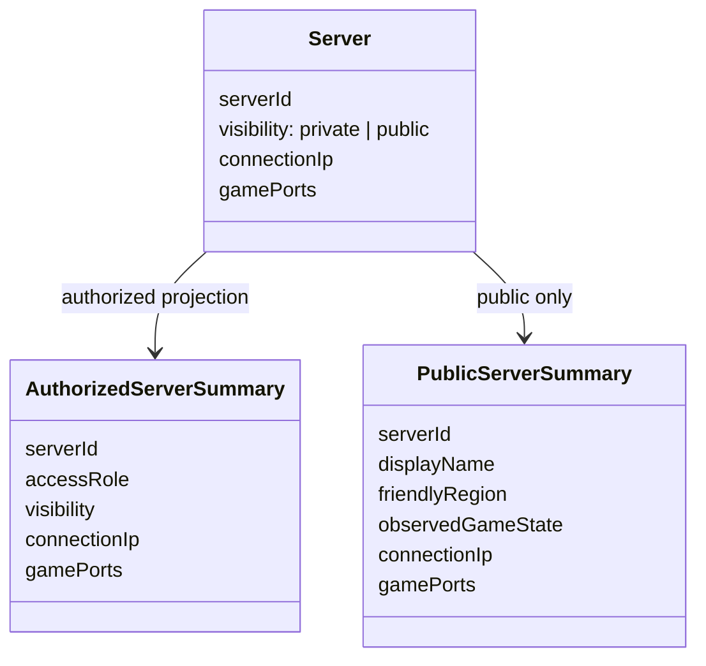
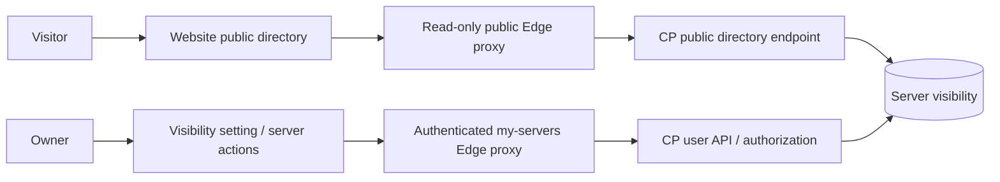

# Server directory and address visibility

## Current backend compatibility

Merged CP #143 supplies authenticated game endpoints. Merged [CP #144](https://github.com/Bannerlord-Coop-Team/BannerlordCoop.ControlPlane/pull/144) adds default-private discovery preference and owner-only mutation while preserving #143's shared-access endpoint policy. It does **not** implement anonymous listing, ownership-transfer consent reset, or the older #107 public-directory design. The website setting therefore describes a saved preference, not immediate publication. The anonymous directory code below remains blocked on a separately agreed backend implementation; a missing route must fail closed without private/sample fallback. Merged source is not deployment evidence.

## Public-directory target behavior (not all supplied by #144)

- Every existing and newly created server is private by default.
- Public servers appear in the anonymous `/servers` directory with their game IP and port.
- Private server addresses are returned only to callers already authorized for that server. A hidden button is not an authorization boundary.
- Authorized users can copy the game endpoint as `IP:port` (bracketed IPv6).
- Changing visibility does not change game connection permissions, firewall rules, passwords, or player allowlists.
- Publishing requires an explicit authorized mutation, not discovery of a running server or the presence of an IP.
- The paired backend excludes deleted, suspended, and entitlement-inactive servers even when marked public. Invalid/unassigned endpoints remain null/empty, disabling Join without inventing an address.
- Public-directory rollout still needs an explicit ownership-transfer consent policy. CP #144 does not reset visibility on transfer; its fresh mutations advance updatedAt, including same-value writes. Replays return the original receipt and do not reapply later state.
- Removing a server from public listing cannot erase addresses that visitors previously copied.

## Minimal boundaries

The control plane owns visibility persistence, authorization, and public projection. The website never fetches an administrative inventory to filter it into public data. Missing visibility is private; missing endpoints disable Join. Public reads use a dedicated read-only endpoint, with a bounded allowlisted response and no caching. Private inventory retains its current authentication boundary.

Owner-facing visibility updates use the authenticated user API and optimistic concurrency. Only the current owner may change visibility; manager, support, and administrator rows remain read-only in this user API. The merged CP #143 authenticated summary exposes stored connection fields using its existing durable owner/shared-access checks; the website consumes that authorized response without inventing a different access policy. CP #144 preserves that policy. The older #107 owner/manager-only endpoint restriction is not assumed or enforced by the website; any change needs explicit backend policy agreement. UI hiding is only presentation, not authorization.

Public data is limited to the server identity/name, friendly region, observed game state, and game endpoint. No owner identities, infrastructure identifiers, agent ports, credentials, or invented player counts are published. Public pages must not fall back to sample or private server data on failure.

## API contract

Authenticated Join uses the merged [CP #143](https://github.com/Bannerlord-Coop-Team/BannerlordCoop.ControlPlane/pull/143) contract directly: `my-servers` items include `connectionIp: string | null` and `gamePorts: number[]`. The existing Edge proxy and website client retain these fields; both My Servers and the managed detail page format the assigned first game port, without assuming port 4200. This works without a `visibility` field or the new anonymous directory endpoint. Null/empty or omitted fields leave Join disabled. Stored endpoints do not prove the game is running, and existing running-state UI checks remain.

CP #144 supplies visibility persistence and mutation but not public listing. Do not interpret an authenticated endpoint as public consent. The following anonymous endpoint remains a proposed integration, not a route supplied by #143/#144.

- Anonymous Edge `GET /functions/v1/public-servers?limit=100&cursor=...` calls only CP `POST /v1/public/control-plane`, operation `public-servers`, input `{cursor, limit}`. The normal version-1 correlated success envelope uses `result: {items, nextCursor}`. Public cursor length is capped at 2048, page size at 100, and game port arrays at 32. This does not alter the existing private API cursor limit.
- Authenticated Edge `POST /functions/v1/my-servers` accepts action `set-server-visibility` with `serverId`, `visibility`, and `expectedUpdatedAt`, plus the caller's UUID `x-request-id`. It forwards the unchanged bearer to CP `/v1/user/control-plane`, operation `set-server-visibility`. CP #144 success is synchronous `{outcome: "updated" | "existing", serverId, visibility, updatedAt}` in the normal `result` envelope, not a job. The Edge and client require that exact result. The mounted setting retains the UUID and exact input across uncertain retries; a changed authoritative generation starts a new request. Success refreshes My Servers rather than treating an old replay receipt as current state. CP enforces durable idempotency and current ownership.
- The new public Edge function deliberately has `verify_jwt = false`; `my-servers` retains `verify_jwt = true`. Both reuse the existing `CONTROL_PLANE_ADMIN_URL` origin and `CONTROL_PLANE_WEB_ORIGINS` allowlist. No service-role key or user session is sent to the public endpoint.

## Verification and rollout

Required tests cover private-by-default persistence, unauthorized update rejection, private endpoint non-disclosure, public-to-private removal, strict public response projection, no-store responses, missing-field rollout, clipboard failures, and optimistic-concurrency failures. Public information already delivered to a browser cannot be recalled; no-store prevents intentional shared caching but is not a revocation mechanism for previously learned addresses.

The website PR remains draft while its anonymous directory dependency is unimplemented; #144 alone does not complete the public-listing feature. Migration files, if required, are reviewed source changes only. Production deployment and live SQL are not part of this implementation authorization.
