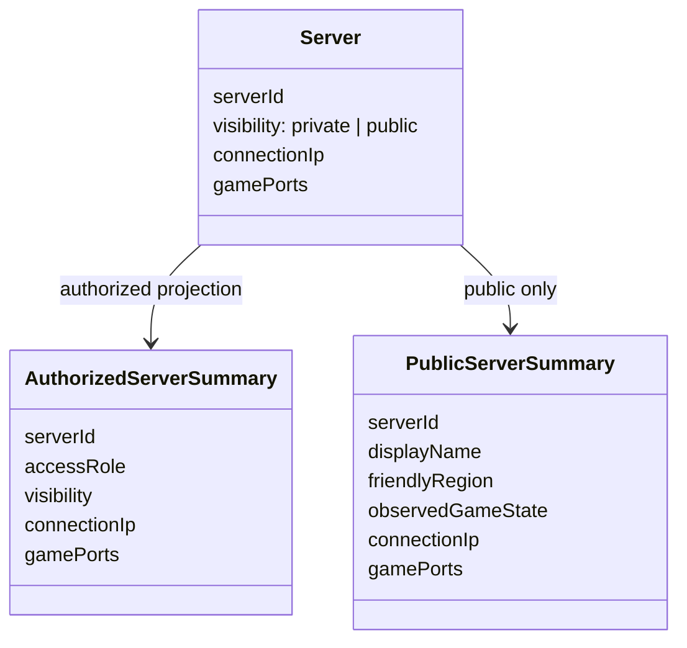
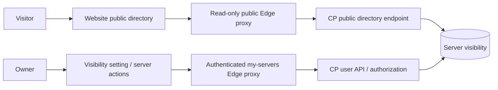

# Server directory and address visibility

## Required behavior

- Every existing and newly created server is private by default.
- Public servers appear in the anonymous `/servers` directory with their game IP and port.
- Private server addresses are returned only to callers already authorized for that server. A hidden button is not an authorization boundary.
- Authorized users can copy the game endpoint as `IP:port` (bracketed IPv6).
- Changing visibility does not change game connection permissions, firewall rules, passwords, or player allowlists.
- Publishing requires an explicit authorized mutation, not discovery of a running server or the presence of an IP.
- Removing a server from public listing cannot erase addresses that visitors previously copied.

## Minimal boundaries

The control plane owns visibility persistence, authorization, and public projection. The website never fetches an administrative inventory to filter it into public data. Missing visibility is private; missing endpoints disable Join. Public reads use a dedicated read-only endpoint, with a bounded allowlisted response and no caching. Private inventory retains its current authentication boundary.

Owner-facing visibility updates use the authenticated user API and optimistic concurrency. The control plane must enforce the exact mutation permission; UI hiding is only presentation. Administrative permissions must follow the control plane's existing policy rather than granting new authority from a website role.

Public data is limited to the server identity/name, friendly region, observed game state, and game endpoint. No owner identities, infrastructure identifiers, agent ports, credentials, or invented player counts are published. Public pages must not fall back to sample or private server data on failure.

## Verification and rollout

Required tests cover private-by-default persistence, unauthorized update rejection, private endpoint non-disclosure, public-to-private removal, strict public response projection, no-store responses, missing-field rollout, clipboard failures, and optimistic-concurrency failures. Public information already delivered to a browser cannot be recalled; no-store prevents intentional shared caching but is not a revocation mechanism for previously learned addresses.

The website PR remains draft until the paired CP contract and implementation are reviewed. Migration files, if required, are reviewed source changes only. Production deployment and live SQL are not part of this implementation authorization.
