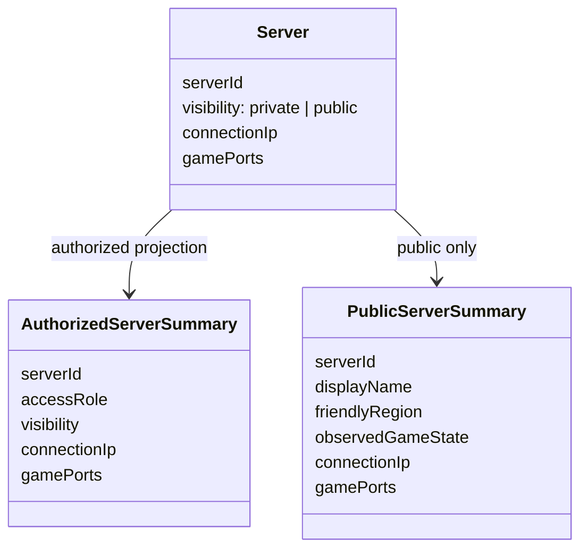
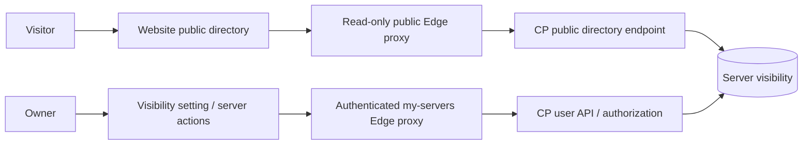

# Server directory and address visibility

## Current backend compatibility

The website implements the public directory page at `/servers` and the anonymous `public-servers` Edge proxy, which expects the control-plane public directory API described below. Settings and the header describe Public as allowing discovery with the server's game address; Private excludes the server from the directory. Visibility does not grant management access or change game connection permissions.

This website integration does not establish backend support or deployment availability. CP #144 supplies visibility persistence and mutation. The companion backend change for [CP #196](https://github.com/Bannerlord-Coop-Team/BannerlordCoop.ControlPlane/issues/196) adds the anonymous listing route and migration 088 for ownership consent. Confirm that this backend and its migration are deployed before rollout; a missing backend route is an integration gap, not a temporary outage. If configuration, the Edge function, or the upstream directory is unavailable, `/servers` reports that the directory could not be loaded right now. It never substitutes private inventory or demo servers. Check the deployed route and its dependencies when diagnosing an outage; the Settings copy is not a deployment health indicator.

## Public-directory contract and backend requirements

- New servers are private by default. Migration 088 preserves an existing Public preference only when the latest visibility receipt proves the current owner chose Public; inherited or unproven preferences become visibly Private so the owner can opt in again.
- Public servers appear in the anonymous `/servers` directory with their game IP and port.
- Private server addresses are returned only to callers already authorized for that server. A hidden button is not an authorization boundary.
- Authorized users can copy the game endpoint as `IP:port` (bracketed IPv6).
- Changing visibility does not change game connection permissions, firewall rules, passwords, or player allowlists.
- Publishing requires an explicit authorized mutation, not discovery of a running server or the presence of an IP.
- The paired backend excludes deleted, suspended, and entitlement-inactive servers even when marked public. Invalid/unassigned endpoints remain null/empty, disabling Join without inventing an address.
- The paired backend resets visibility to Private atomically when ownership changes, including provider-generation ownership cutover. The new owner must explicitly choose Public. Visibility mutations retain the existing receipt and concurrency contract: fresh writes advance updatedAt, while replays return the original receipt without reapplying later state.
- Removing a server from public listing cannot erase addresses that visitors previously copied.

## Minimal boundaries

The control plane owns visibility persistence, authorization, and public projection. The website never fetches an administrative inventory to filter it into public data. Missing visibility is private; missing endpoints disable Join. Public reads use a dedicated read-only endpoint, with a bounded allowlisted response and no caching. Private inventory retains its current authentication boundary.

Owner-facing visibility updates use the authenticated user API and optimistic concurrency. Only the current owner may change visibility; manager, support, and administrator rows remain read-only in this user API. The merged CP #143 authenticated summary exposes stored connection fields using its existing durable owner/shared-access checks; the website consumes that authorized response without inventing a different access policy. CP #144 preserves that policy. The older #107 owner/manager-only endpoint restriction is not assumed or enforced by the website; any change needs explicit backend policy agreement. UI hiding is only presentation, not authorization.

Public data is limited to the server identity/name, friendly region, observed game state, and game endpoint. No owner identities, infrastructure identifiers, agent ports, credentials, or invented player counts are published. Public pages must not fall back to sample or private server data on failure.

```mermaid
classDiagram
    class Server {
        serverId
        visibility: private | public
        connectionIp
        gamePorts
    }
    class AuthorizedServerSummary {
        serverId
        accessRole
        visibility
        connectionIp
        gamePorts
    }
    class PublicServerSummary {
        serverId
        displayName
        friendlyRegion
        observedGameState
        connectionIp
        gamePorts
    }
    Server --> AuthorizedServerSummary : authorized projection
    Server --> PublicServerSummary : public only
```

```mermaid
flowchart LR
    Visitor --> Website[Website public directory]
    Website --> PublicEdge[Read-only public Edge proxy]
    PublicEdge --> PublicCP[CP public directory endpoint]
    Owner --> Settings[Visibility setting / server actions]
    Settings --> PrivateEdge[Authenticated my-servers Edge proxy]
    PrivateEdge --> PrivateCP[CP user API / authorization]
    PublicCP --> DB[(Server visibility)]
    PrivateCP --> DB
```

## API contract

Authenticated Join uses the merged [CP #143](https://github.com/Bannerlord-Coop-Team/BannerlordCoop.ControlPlane/pull/143) contract directly: `my-servers` items include `connectionIp: string | null` and `gamePorts: number[]`. The existing Edge proxy and website client retain these fields; both My Servers and the managed detail page format the assigned first game port, without assuming port 4200. This works without a `visibility` field or the new anonymous directory endpoint. Null/empty or omitted fields leave Join disabled. Stored endpoints do not prove the game is running, and existing running-state UI checks remain.

Visibility persistence and mutation use the authenticated API. The website public directory calls the separate anonymous integration below; an authenticated endpoint alone is not public consent or evidence that the required public backend route exists.

- Anonymous Edge `GET /functions/v1/public-servers?limit=100&cursor=...` calls only CP `POST /v1/public/control-plane`, operation `public-servers`, input `{cursor, limit}`. The normal version-1 correlated success envelope uses `result: {items, nextCursor}`. The Edge accepts cursors up to 2048 characters; the paired backend enforces its tighter 1024-character cursor limit. Page size is capped at 100 and game port arrays at 32. This does not alter the existing private API cursor limit.
- Authenticated Edge `POST /functions/v1/my-servers` accepts action `set-server-visibility` with `serverId`, `visibility`, and `expectedUpdatedAt`, plus the caller's UUID `x-request-id`. It forwards the unchanged bearer to CP `/v1/user/control-plane`, operation `set-server-visibility`. CP #144 success is synchronous `{outcome: "updated" | "existing", serverId, visibility, updatedAt}` in the normal `result` envelope, not a job. The Edge and client require that exact result. The mounted setting retains the UUID and exact input across uncertain retries; a changed authoritative generation starts a new request. Success refreshes My Servers rather than treating an old replay receipt as current state. CP enforces durable idempotency and current ownership.
- The new public Edge function deliberately has `verify_jwt = false`; `my-servers` retains `verify_jwt = true`. Both reuse the existing `CONTROL_PLANE_ADMIN_URL` origin and `CONTROL_PLANE_WEB_ORIGINS` allowlist. No service-role key or user session is sent to the public endpoint.

## Verification and rollout

Required tests cover private-by-default persistence, unauthorized update rejection, private endpoint non-disclosure, public-to-private removal, strict public response projection, no-store responses, missing-field rollout, clipboard failures, and optimistic-concurrency failures. Public information already delivered to a browser cannot be recalled; no-store prevents intentional shared caching but is not a revocation mechanism for previously learned addresses.

Verify the deployed website, Edge function, and control-plane routes separately before claiming live availability. Migration files, if required, are reviewed source changes only. Production deployment and live SQL are not part of this copy correction.
