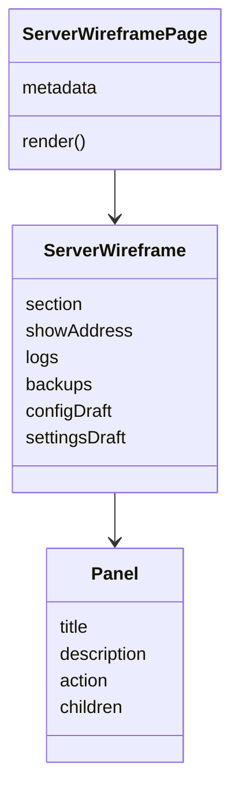
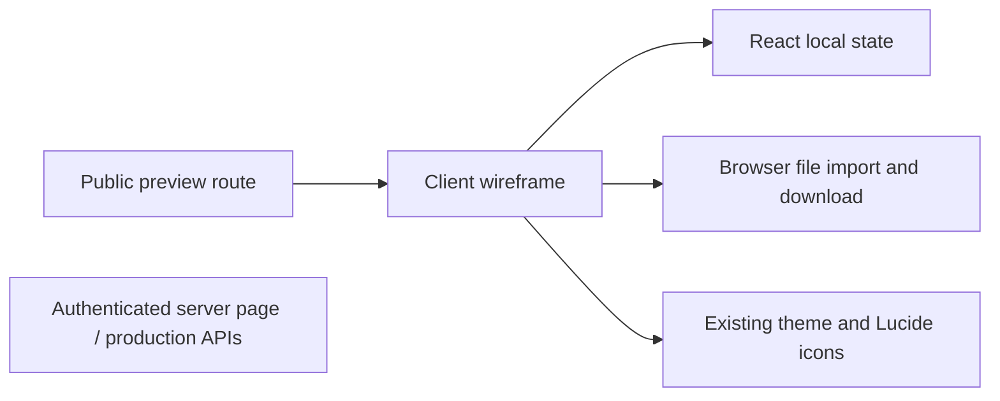

# Server management wireframe

Public route: `/servers/wireframe`. Append this path to the Cloudflare preview origin after deploying this branch. No sign-in, environment variables or server connection are needed by this route. The authenticated `/servers/[serverId]` implementation is unchanged.

## Scope and layout

- Header: inline server-name editing, sample status, and IP:Port hidden by default with Show/Hide and Copy join address grouped together. Compact visibility dropdown offers Private/Public with a checkmark on the current choice; detailed visibility guidance remains in Settings.
- Console (default): Start, Stop and Restart controls update the local demo status and console log only. Stop/Restart require confirmation (Cancel or Escape returns focus); unavailable actions are disabled, and commands cannot be sent while stopped. The three controls stay in one row on narrow phones. Readable, top-aligned output and anchored command entry. Follows new output until the user scrolls up; Jump to latest resumes following. Searchable, grouped command rows sit alongside it on desktop and collapse into a picker below the input on mobile. Selecting a command fills the input without executing and selects example arguments for replacement. Download logs exports the current demo output as text.
- Backups: history, create and explicit restore confirmation.
- Save & config: compact campaign-save row with Import/Export buttons and a replacement confirmation with Cancel after file selection. JSON imports/exports share the editor toolbar; import stages a draft, and Save config validates JSON automatically. Errors remain beside the editor and feedback sits in the sticky save bar; Discard/Save appear only with pending changes. The inactive form preview has no transfer or save controls and retains the JSON draft when switching modes.
- Settings: name and public/private directory visibility use the same sticky save bar, pending-change language and conditional Discard/Save actions as Configuration. Directory visibility is not management authorization or a join restriction.
- Consistency: shared panel spacing, button styles, inline feedback and save bars. All four workspace tabs remain visible on mobile; visibility sits beside server status so the name has its own row. Pending-change text stacks above save actions on narrow screens. Amber confirmations place Cancel before the explicit destructive action; confirmations return focus to their initiating control.
- Feedback: one neutral preview banner, dismissible header feedback for identity/connection actions, and action feedback inside its relevant panel (cleared when switching workspaces). Drafts survive tab switches; notifications never appear in another workspace.

The page uses fictional data and component state, reset on refresh. The reserved documentation IP is illustrative. Hiding an address is a presentation convenience, not access control. Commands and config keys are illustrative, not assertions about game behavior. Save and backup actions are simulations, clearly labeled; JSON import/export and log download work locally. No production APIs or console connections are imported. A no-index directive keeps the design preview out of search results.

## Component structure

No schema library is introduced until the actual schema and editing requirements are available. The schema preview is intentionally disabled rather than pretending to validate or synchronize arbitrary config fields.
