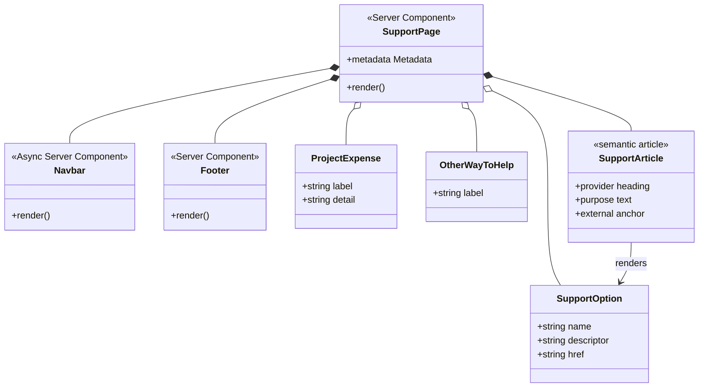

# Bannerlord Coop Support Page

## Required behavior

- Add a complete `/support` route with the shared navigation and footer.
- Keep the route content in a Server Component with static metadata and no page-level client JavaScript.
- Explain that Bannerlord Coop is volunteer-developed and will always be free.
- Explain that support covers development tools, hosting infrastructure, dedicated servers, distribution costs, and other project expenses.
- Present exactly five external support choices with their purpose and canonical destination:
  - Patreon — monthly support — `https://www.patreon.com/c/bannerlordcoop`
  - Buy Me a Coffee — one-time contribution — `https://buymeacoffee.com/bannerlordcoop`
  - PayPal — direct donation — `https://www.paypal.com/donate/?hosted_button_id=KHBSK4FXQ9GKS`
  - Afdian — support from China — `https://ifdian.net/a/BannerlordCoop`
  - Boosty — international support — `https://boosty.to/bannerlordcoop/donate`
- Make optionality prominent and give playing, reporting bugs, creating content, and sharing the project equal legitimacy as ways to help.
- End with a clear thank-you.

## Non-goals

- No payment processing, forms, donor accounts, tiers, rewards, progress totals, database, API route, webhooks, analytics, or CMS.
- No client state, animation, platform picker, modal, or new dependency.
- No platform logos, custom brand assets, or page-owned icon-package components.
- No claims about tax treatment, refunds, earmarking, priority, or special access.
- No changes to the shared navigation, footer, global CSS, or authentication behavior.

## Minimum-complexity design

The page owns three small immutable data sets: project expense descriptions, the five external support options, and the four non-financial ways to help. The route maps those records directly into semantic list items and articles. It composes the existing `Navbar` and `Footer`, uses existing Tailwind design tokens, and sends donation clicks directly to each external provider. There is no application state or service layer.

The visual structure is restrained and editorial: a promise-led hero, a compact expense summary, equal-weight support cards, and a prominent optionality closing panel. Thin borders, dark surfaces, Cormorant display type, gold accents, and restrained crimson actions keep the page native to the existing Bannerlord Coop language without adding global styles or imagery.

## Responsive and accessibility notes

- The layout is mobile-first. Content begins as a single column, support cards become two columns at `sm` and three at `lg`, and the expense list expands from one to two to five columns.
- `site-container` provides consistent responsive gutters and all grid children use flexible widths to avoid horizontal overflow.
- The route has one `<main>`, one visible `<h1>`, sequential `<h2>` and `<h3>` headings, labelled sections, semantic lists, and semantic support-option articles.
- Each external action has meaningful text, a minimum 48-pixel target height, a visible keyboard focus ring, `target="_blank"`, `rel="noopener noreferrer"`, and screen-reader text announcing the new tab.
- Provider cadence and regional purpose are written as text rather than conveyed by decoration.
- CSS-only decorative markers and generated card numbers use `aria-hidden="true"`.
- Unique route metadata and the descriptive H1 support Next.js route announcements.
- The page introduces no motion, so no page-specific reduced-motion behavior is necessary.

## Component and type relationships



## Dependency flow

```mermaid
flowchart TD
    Route[/support] --> Page[src/app/support/page.tsx\nServer Component]
    Page --> Metadata[next Metadata]
    Page --> Navbar[src/app/components/layout/Navbar.tsx]
    Navbar --> MobileNavigation[src/app/components/layout/MobileNavigation.tsx\nexisting client boundary]
    Page --> Footer[src/app/components/layout/Footer.tsx]
    Page --> Tokens[src/app/globals.css\nexisting tokens + site-container]
    Page --> Providers[External support providers]
    Providers --> Patreon[Patreon / monthly]
    Providers --> Coffee[Buy Me a Coffee / one-time]
    Providers --> PayPal[PayPal / direct]
    Providers --> Afdian[Afdian / China]
    Providers --> Boosty[Boosty / international]
```

## Rendering note

The support route itself performs no data access and remains a Server Component. The shared `Navbar` is intentionally reused unchanged; because it checks the current Supabase session, Next.js may render the composed route dynamically at request time even though all support-page content is static. Removing that existing behavior is outside this page's scope.

## Acceptance checks

- `/support` compiles without a client directive or page-level browser logic.
- Static metadata has a unique support title and description.
- All five provider names, purposes, and exact URLs are present.
- External links open safely in a new tab and have visible focus treatment and meaningful accessible text.
- Copy includes the volunteer/free commitment, all stated project expenses, explicit financial optionality, four non-financial ways to help, and the thank-you.
- Narrow and wide layouts contain no fixed-width content that can force horizontal scrolling.
- `npm run lint` and `npm run build` pass.
